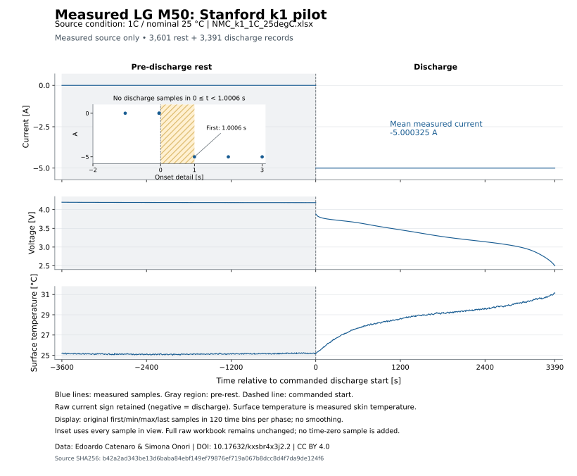
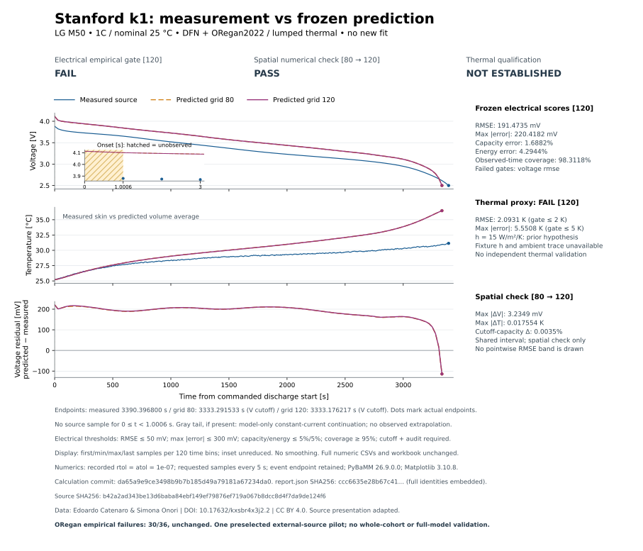
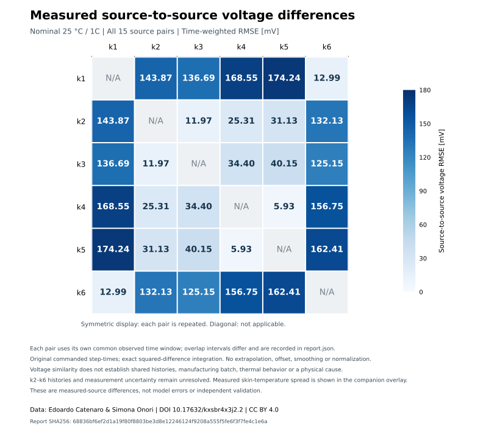
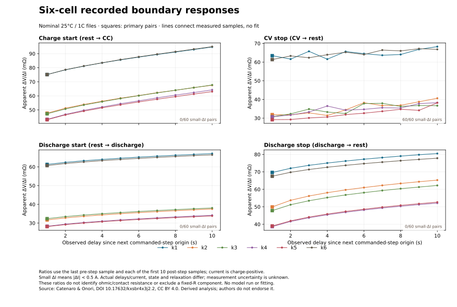

Build it from physical properties. Test it. Fly it. Break it. Build it better.

# Physical-Fpv-Simulator

Physics-first FPV simulator built from real physical properties.

**Physics fidelity first.** Adjustable engineering variables must act through explicit physical models, units and evidence. No arbitrary performance buffs.

## Battery research core: first executable slice

A CPU-only Python research tool built around **PyBaMM 26.9.0.0**, with SPM, SPMe and Doyle–Fuller–Newman (DFN) models. The first benchmark uses the published **Chen2020 LG M50** parameters and **three real cells at four discharge rates**. It downloads the original measurements, checks their checksums, runs unchanged parameters, and reports every error and failed gate.

This is public-benchmark reconstruction, **not independent validation**, a battery safety tool, or a flight-ready simulator. The original study used these cells during parameterization and adjusted diffusivity by rate. This implementation does not fit to the traces. Cell03/04 are reserved implementation checks only.

The initial 20-point mesh failed the predeclared numerical target at high rates. We retain that result and audit a refined 40-point grid against 80 points. Experimental acceptance thresholds are unchanged. See [the frozen protocol](docs/validation-protocol.md), [numerical refinement](docs/numerical-refinement.md), and [initial results](docs/benchmarks/initial-mesh20.md).

## Run it

Python 3.12, Linux CPU is the tested environment. No account, API key, GPU or paid service is needed.

```sh
python3.12 -m venv .venv
. .venv/bin/activate
python -m pip install -r requirements-lock.txt
python -m pip install --no-deps -e .
physical-fpv fetch-data
physical-fpv simulate --model DFN --current 5 --out results/example
physical-fpv benchmark --out results/dfn
pytest -q
ruff check src tests
```

The benchmark writes `report.json`, `report.md`, a report checksum, and voltage/capacity/temperature/lithium time-series CSVs. Current is amperes, time seconds, voltage volts, capacity ampere-hours and temperature kelvin. Use `--require-pass` to return exit code 2 when any frozen research gate fails. A normal completed report command can exit zero while its scientific gates fail; **read the report**. `--skip-numerics` is exploration only and can never produce a passing research gate.

```sh
physical-fpv benchmark --model SPMe --out results/spme
physical-fpv simulate --thermal lumped --out results/exploratory-thermal
physical-fpv material-method-check
```

Lumped thermal simulation is explicitly **unvalidated**: several built-in Chen2020 thermal properties are generic defaults, entropy terms are zero, and some transport laws lack temperature dependence. Isothermal temperature is an imposed assumption, not a predicted temperature. Numerical heat-balance checks do not establish agreement with measured temperature.

## Offline evidence verification

Use `physical-fpv verify-replay --receipt RECEIPT.json --inputs INPUTS.zip --outputs OUTPUTS.zip`
to check saved replay artifacts and reproduce their voltage/numerical metrics
without downloading data or solving a model. [Usage, exit codes and limits](docs/offline-replay-verification.md).

## Current results

The [current-profile arithmetic correction](docs/current-profile-arithmetic.md)
fixes near-knot precision and prevents automatic scientific reruns on PR cache
misses. The [bounded current-source replays](docs/current-source-replay-findings.md)
now pass the two selected spatial checks; k1 still fails its50mV empirical gate
at191.473522mV. Historical k2 results remain tied to their original implementation.

The explicitly new [Stanford k2 recovery](docs/stanford-k2-recovery-findings.md)
completed both meshes within 911.043 seconds. Its 80→120 spatial check passes,
but grid120 voltage RMSE is **55.003054 mV versus the unchanged 50-mV target: FAIL**.
The original lost grid120 attempt remains unknown. Complete native snapshots,
terminal receipts and a no-solve verifier are preserved with the result.
The subsequent [zero-solve residual audit](docs/stanford-k2-residual-audit.md)
locates 86.1% of squared voltage error in a sustained positive-discrepancy phase;
it cannot uniquely identify a physical cause from the retained global outputs.
The [single frozen internal-state diagnostic](docs/stanford-k2-state-findings.md)
now exactly reproduces that result, verifies signed voltage/inventory accounting,
and resolves the model's late negative-particle polarization and support-exit
timing. A subsequent saved-state OCP calculation does not explain the broad
residual through its small direct temperature term. Empirical acceptance remains FAIL.
The [saved-data rest/inventory screen](docs/stanford-k2-rest-inventory-findings.md)
adds three measured zero-current anchors. It finds conditional joint
inventory/OCP/rest-proxy discrepancies, without fitting SOC or identifying a
unique physical cause, and specifies the missing independent constraints.

The separate [low-rate mesh80/120 comparison](docs/stanford-k2-mesh120-findings.md)
now passes the unchanged mesh-pair and record-level gates at fixed 1e-8 tolerance:
0.045787 mV maximum mesh voltage difference and 19.210536 mV fine-grid voltage RMSE.
Both physical audits and cutoff events pass. This previously viewed low-rate
record does not establish independent validation or repair the historical
high-rate failures; thermal-domain and history assumptions remain explicit.

The [qualified saved low/high-rate comparison](docs/stanford-k2-qualified-rate-findings.md)
retains the conditional rate-gap mismatch at all nine predeclared Ah locations
across four saved mesh combinations. This does not identify a unique physical
cause or establish matched SOC; the high-rate empirical failure remains.

Current local software and saved-evidence checks pass (702 tests, 7 skipped). In the historical refined Chen benchmark, the **experimental gate passes 6 of 12 traces and fails 6 of 12**; overall research acceptance remains **FAIL**. Numerical convergence passes. Thermal validity is **not established**. See [the complete refined report](docs/benchmarks/refined-mesh40.md). CI separately enforces software/numerical checks and uploads the empirical failures without treating them as a scientific pass.

## Thermal reconstruction: inspect the second cohort

The ORegan2022 extension covers **36 first-discharge traces from12 LG M50 cells**, at0/10/25°C and0.5/1/2C. Published diffusion corrections and h=15 W/m²/K are declared; no new fit or initial-voltage alignment is performed.

On grid40, **6/36 empirical targets pass and30/36 fail**. Voltage RMSE ranges24.51–88.00mV; surface-proxy temperature RMSE0.35–14.68K, including the retained cell791 anomaly. All36 actual-node/surface, lithium, charge and heat-balance audits pass. These are separate findings: **this is not a mature, qualified battery model**.

The 1C/25°C representative40→80 mesh check actually completed in187 seconds but **failed convergence targets**: maximum voltage difference14.33mV versus5mV, and temperature difference0.207K versus0.1K. Peaks occur at340s and970s, not at the slightly different cutoff endpoints. The same-case80→120 check has now passed:3.321mV maximum voltage difference,0.0180K temperature difference and0.00345% capacity difference, within the20-minute/4GB budget. The exact source run is [37681264082](https://github.com/lijiabao1998/Physical-Fpv-Simulator/actions/runs/37681264082) at f746e0e. Packaging-only changes reuse this recorded result after checking calculation fingerprints; CI explicitly labels reuse rather than claiming a new solve. Whole-cohort numerical verification remains open. Cold conditions and some hot endpoints extrapolate measured parameter ranges.

- [Full36-case thermal report](docs/benchmarks/thermal-grid40.md) and [machine-readable summary](docs/benchmarks/thermal-summary.json)
- Raw-data inspection, duplicate counts and sensor flags: run physical-fpv thermal-inspect
- [Representative numerical comparison](docs/benchmarks/thermal-representative-grid-comparison.json) and [solver statistics](docs/benchmarks/thermal-solver-statistics.txt)
- [Frozen thermal protocol](docs/thermal-protocol.md), [numerical status](docs/thermal-numerical-status.md), and [ghost-point audit correction](docs/concentration-audit-correction.md)

```sh
physical-fpv thermal-fetch-data
physical-fpv thermal-inspect
physical-fpv thermal-benchmark --skip-numerics --out results/thermal-final
python scripts/render_thermal_evidence.py
python scripts/verify_thermal_grid.py --timeout 600
```

The36-case grid40 report intentionally marks numerical stages NOT RUN. The separate representative result does not establish convergence for the remaining conditions. Running thermal-benchmark without --skip-numerics requests all frozen numerical checks and is computationally heavier.

See [the first no-fit causal diagnosis](docs/causal-diagnosis.md) for grouped failures, the original TEC implementation differences, and the unchanged-parameter cell790 check. Standalone evidence exports now carry authors, DOI, source-license distinctions and required notices; this does not select a license for original project code.

## What is implemented

- Published porous-electrode electrochemistry, bounded solver settings and version-pinned dependencies
- Attributed, checksum-pinned CC-BY-4.0 experimental data retrieval (about 1.8 MB; not vendored)
- Correct discharge selection, current-sign semantics, units and initial concentrations
- Time-weighted voltage RMSE, maximum error, cutoff capacity error, overlap coverage and correct-termination gates
- Mesh/tolerance convergence, lithium inventory, current integration, sampled concentration bounds and exploratory heat balance
- Input-range rejection and temperature-event termination; no claim that these guards certify safe batteries
- A provenance/uncertainty-aware materials interface and an analytical atomic-hop method check
- Tests that reject passing claims for truncated traces, unqualified material mappings and temperature-triggered stops

## Materials and scale boundaries

The analytical jump-network tool evaluates a prescribed, balanced random walk using migration barriers and rates. It does **not** compute those barriers from atomic coordinates or discover a material. Tracer diffusion cannot be silently used as chemical diffusivity; formation energy cannot be used as migration energy or conductivity. The materials interface rejects unsupported mappings and records structure hashes, method, source, temperature support and uncertainty.

The intended chain is:

`atomic structure -> qualified property calculation -> electrode effective parameters -> cell -> pack -> FPV load`

Each arrow requires a validated method and a declared domain. Missing physics stays unsupported, rather than being filled with invented data. See [the roadmap](docs/roadmap.md).

## Evidence and licensing

- [Data manifest, sources and attribution](data/manifest.json)
- [Scientific scope and source licenses](docs/evidence.md)
- [Dependency license inventory](docs/dependency-licenses.json)

This project is not affiliated with or endorsed by the laboratories, authors, manufacturers or software projects cited. Dependency and dataset licenses remain their own. No open-source license for this repository's original code has been selected yet.

The unchanged-state cell790 polarization diagnostic completed in780.04seconds within its frozen1200-second/4GB budget. Voltage decomposition and electrode-inventory checks passed, and the previous120-point curve was reproduced within5.64e−8V. The largest modeled cutoff loss is338.65mV from negative-particle concentration polarization. This explains the frozen model’s behavior; it does not identify the real cell’s unique failure mechanism or repair the30/36 experimental failures. See [the findings](docs/polarization-findings.md), [exact evidence](docs/benchmarks/polarization-grid120-summary.json) and [predeclared protocol](docs/polarization-protocol.md).

## External experimental-data acquisition

The Stanford Catenaro–Onori exact-M50 manifest now pins six25°C/1C workbooks with official sizes and SHA256 hashes. The predeclared k1 pilot and manufacturer workbook have been retrieved and verified. Its28,669 measured records contain all six protocol steps; the recorded discharge is approximately5.000325A despite the4.85Ah specification, and its first discharge sample is1.0006s after the commanded start. These facts are preserved without time-zero alignment or fitting.

```sh
python -m pip install --index-url https://pypi.org/simple --only-binary=:all: --no-deps --require-hashes -r requirements-data-lock.txt
python scripts/inspect_stanford_pilot.py --fetch
```

This command inspects real measurements and exports their observed discharge segment. It does not solve a model. The bounded 15-file k1 chronology inspection is now complete: 530,735 records, verified checksums and consistent clocks. Only a 25°C/0.05C record precedes the selected 1C pilot in this published campaign. Unrecorded history remains unknown, and independent predictive validation is not yet established. See [source manifest](data/stanford-manifest.json), [predeclared acquisition protocol](docs/stanford-acquisition-protocol.md), [pilot findings](docs/stanford-pilot-findings.md) and [inspection JSON](docs/benchmarks/stanford-k1-inspection.json).

The [recorded chronology](docs/stanford-chronology-findings.md) shows that some later high-rate records ended near the published thermal stop instead of 2.5 V. Treat these as repeated measurements of one cell and retain their prior exposure and possible thermal curtailment. Run `python scripts/inspect_stanford_chronology.py --fetch` to reproduce the bounded inspection.

## Prospective external-current pilot

The first [frozen Stanford k1 run](docs/stanford-validation-protocol.md) exhausted its20-minute budget while integrating mesh80; it produced no prediction curve, and mesh120 never started. Its [verified execution evidence](docs/benchmarks/stanford-k1-verified-evidence.json) is preserved. That first attempt left experimental agreement and numerical convergence **NOT EVALUATED**. The completed third attempt below now establishes a numerical PASS and an empirical FAIL; the existing30/36 ORegan empirical failures also remain.

A [predeclared60-second scheduling experiment](docs/stanford-scheduling-diagnostic.md) held the mesh, complete measured-current interpolant, parameters, tolerance and72 output times identical. Native integration took47.789s with61 stops versus1.535s with two endpoints. Maximum differences were2.07microvolts,0.000000754K and0.00000000376Ah; both physical audits passed. This identifies substantial restart overhead for the prefix, not full-discharge validity. See [exact evidence](docs/benchmarks/stanford-scheduling-prefix.json).

The [scheduling addendum](docs/stanford-scheduling-addendum.md) changes only integration stops, preserves every forcing/output point, and requests the same single80→120 pilot under the original20-minute/4GB budget. The second attempt completed mesh80 with electrical RMSE190.899mV, failing the50mV gate. Capacity error1.685%, energy error4.280% and98.315% coverage passed; temperature-proxy RMSE2.097K and maximum5.556K failed. In that second attempt, mesh120 exhausted the4GB address-space limit during spatial-interpolation postprocessing, leaving80→120 verification unavailable at that stage. No curve is fitted or gate relaxed; Stanford cooling remains an unidentified boundary, and temperature comparison remains a skin-versus-average proxy.

The preceding constant-current numerical regression at a8eb171 completed in480.08s and passed. Its curve differed from the original120-point curve by at most5.64e-8V and8.70e-8K, with identical physical parameter fingerprints. [Regression evidence](docs/benchmarks/constant-profile-regression.json) and the original880-second evidence are retained separately.

## Inspect the actual measurement



The source-only figure preserves the first1.0006seconds as missing and labels measured skin temperature. Display compression retains original local extrema; it does not smooth or change the archived records. Reproduce the figure with optional, separately pinned plotting dependencies:

```sh
python -m pip install --index-url https://pypi.org/simple --only-binary=:all: --no-deps --require-hashes -r requirements-plot-lock.txt
python scripts/render_stanford_measurements.py
```

[Plotting dependency sources and declared licenses](docs/plot-dependency-licenses.json) are separate from the numerical lock and source-data licenses.

## Completed numerical audit; empirical disagreement remains



The [native-audit continuation](docs/stanford-memory-addendum.md) completed at da65a9e in [CI37734574725](https://github.com/lijiabao1998/Physical-Fpv-Simulator/actions/runs/37734574725), within900.070s of its1200s/4GB budget. Peak process RSS was2.05GiB. It reused the authenticated3989-row mesh80 curve and ran only the previously unsaved120-point case. Every native120×120×3989 concentration value per electrode, explicit surface concentration and physical audit remained included.

**Spatial80→120 PASS:** maximum differences3.23494mV and0.0175543K, with0.0034589% cutoff-capacity difference. Their peaks occur at142.0001s and924.0013s, away from cutoff. **Electrical empirical FAIL:** the120-point voltage RMSE is191.474mV against50mV. Capacity error1.688%, energy error4.294% and98.312% coverage pass. **Temperature-proxy FAIL:** RMSE2.093K and maximum5.551K; unknown fixture cooling and skin-versus-average comparison prevent independent thermal qualification. Numerical stability does not repair the failed physical prediction.

[Complete verified evidence](docs/benchmarks/stanford-k1-v3-verified-evidence.json) contains actual reports, unchanged gates, code/data hashes, memory use and artifact provenance. The full120-point time-series CSV is retained with its checksum in a [gzip archive](docs/benchmarks/stanford-k1-mesh120-v3.csv.gz). [The historical second attempt](docs/benchmarks/stanford-k1-v2-verified-evidence.json) and its [partial plot](docs/benchmarks/stanford-k1-partial-comparison.svg) remain available. Exact calculation fingerprints permit result-only commits to reuse the completed outcome, including its failures, without repeating the solve.

The constant-current regression at the same commit also completed in850.063s:3.32093mV/0.0180177K, physical and numerical checks PASS. [Its historical evidence](docs/benchmarks/grid120-verified-evidence.json) preserves earlier source results separately. Neither single case establishes whole-cohort convergence or repairs Chen6/12 and ORegan30/36 empirical failures.

A [no-solve residual and source diagnostic](docs/stanford-residual-findings.md) identifies a large loaded-voltage discrepancy despite a−5.40mV initial rest-OCV difference. The measured transition ratio is61.3mΩ, similar in scale to the authors' published59mΩ pulse average; different measurement definitions prevent attributing that value to contact resistance. No corrective resistor, voltage offset or initial-SOC fit is applied.

To render the actual complete evidence after downloading the v3 CI artifact, or to reproduce the source diagnostic:

```sh
python scripts/render_stanford_comparison.py --evidence-dir results/stanford-k1-v3-ci/stanford-k1-pilot --out results/stanford-k1-comparison.svg
python scripts/diagnose_stanford_residuals.py
```

The [same-cell transition audit](docs/stanford-transition-findings.md) checks all15 already-pinned k1 records with no new solve. It retains sampling delays, protocol/history and unknown measurement uncertainty. Apparent transient ratios span32.50–84.01mΩ; no fixed resistor or fitted correction is inferred. Thirteen files have a final rest; the25/35°C5C records do not.

The [parameter-source audit](docs/oregan-kinetics-provenance.md) compares all 80 released half-cell kinetic points and checks the saved surface-state ranges. Both electrodes cross the sampled stoichiometry envelope during the recorded trajectory; crossing times are unavailable. Positive coating conductivity also extrapolates its measured temperature range. These annotations preserve the numerical PASS and empirical FAIL, without fitting or altering acceptance gates.


## Six-cell measured-source comparison

All six preselected Stanford25°C/1C workbooks have now been checked, with all15 source-to-source pairs retained. k1 and k6 have similar loaded-voltage traces (12.99mV RMSE); k2–k5 differ from k1 by136.69–174.24mV. Their actual CC/CV histories and skin temperatures differ, while manufacturing batch, unpublished exposure and measurement/fixture uncertainty remain unresolved. These are two observed patterns, with no causal classes or model-accuracy claim for the five additional specimens. No new battery model was solved or fitted.

[Full source report, intervals and qualifications](docs/stanford-cohort-findings.md) · [Machine-readable evidence](docs/benchmarks/stanford-six-cell-comparison.json)



The original k1 numerical PASS and191.474mV empirical FAIL remain unchanged, together with Chen6/12 and ORegan30/36 failures. Data inspection does not establish identical initialization or independent full-cell validation.


## Selected history test: source acquisition incomplete

The frozen k2/k6 history inspection verified 27/30 files and 995,676 measurement rows before a CONNECT tunnel returned 403. All 15 k2 records qualify: only its 25°C/0.05C experiment precedes the selected 1C target in the published campaign. Three k6/5C records remain unavailable, so the proposed prior-high-rate contrast is **UNRESOLVED**. The missing chronology is not inferred from upload dates or other specimens. Successfully verified source files are retained; no retry or replacement source was used.

[Partial findings and all recorded intervals](docs/stanford-k2-k6-history-findings.md) · [Provenance, quality and missing-file evidence](docs/benchmarks/stanford-k2-k6-history-partial.json) · [Frozen protocol](docs/stanford-k2-k6-history-protocol.md)

The implementation passed 309 software tests. This data-only inspection ran no model or fit and leaves the existing numerical PASS and empirical FAIL outcomes intact.


## Recorded boundary responses: no resistance fit

The zero-download six-cell audit retains all 24 charge/CV/discharge boundaries and 240 finite-delay observations. Each cell’s apparent ΔV/ΔI varies across boundaries; k1 spans 61.30–75.17 mΩ and k6 60.68–75.16 mΩ. This arithmetic variation does not establish contact resistance or physically exclude a fixed-R component: sampling delays, electrochemical state, relaxation and unknown uncertainty remain relevant. Every CV-stop ratio is retained and flagged for its small ≈0.05-A current change.

[Complete boundary table, interpretation and next required observable](docs/stanford-boundary-findings.md) · [Source-linked numerical report](docs/benchmarks/stanford-six-cell-boundaries.json)



All 349 software tests passed. The measured-source analysis used 6.98 seconds, with zero model runs or fitting; prior empirical failures and incomplete k6 history remain unchanged.
