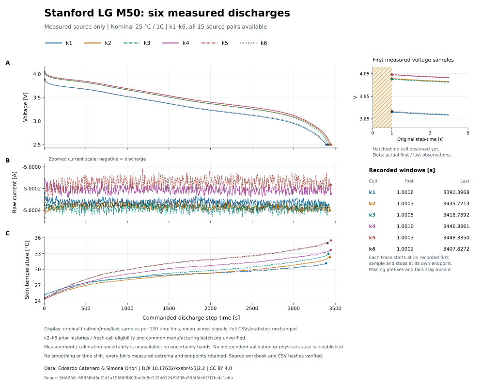

# Stanford six-cell measured-source comparison

k1 is not the only specimen with the lower loaded-voltage behavior: its measured voltage trace is closest to k6 (12.986 mV source-to-source RMSE). The four other records differ from k1 by 136.687–174.240 mV RMSE. These are two observed voltage patterns, not causal classes, confirmed manufacturing batches or predictions of model accuracy on the other specimens.

All six sources and all 15 pairs were retained. No parameters were fitted and no new battery model was solved. The original k1 model remains a numerical PASS and an empirical FAIL at 191.474 mV voltage RMSE; Chen 6/12 and ORegan 30/36 empirical failures remain unchanged.




## Scope and source integrity

The [protocol](stanford-cohort-protocol.md) was committed at eae7d9e40a104421da938c069bdd7683b06ab062 before k2–k6 inspection. The actual reader/comparison implementation was committed at ba2568acc244648134e47bbc190fa4325f4acd84 before acquisition. The run finished in 61.523 seconds under its 600-second limit, downloading exactly 9,104,714 new bytes. Six source workbooks total 10,973,677 bytes and 167,980 rows; 20,550 rows belong to the measured discharges. All official lengths and SHA256 values matched.

Every file has six contiguous protocol steps, strictly increasing step/test clocks and no duplicate timestamps. Date/test-clock discrepancies are at most 2.456 ms. Original discharge rows match the exported CSVs exactly, including negative current and the declared kelvin conversion. The [complete JSON](benchmarks/stanford-six-cell-comparison.json) preserves source identities, full quality checks, actual current histories, all intervals and unavailable uncertainty.

## Observed discharge and initial conditions

Charge integrates recorded negative current over each complete observed discharge, excluding its unobserved initial interval. Apparent transient ratios use the last rest sample and first loaded sample at their actual delay; they are not isolated ohmic/contact resistance.

| Cell | Mean discharge magnitude (A) | First loaded voltage (V) | Observed charge (Ah) | Last step-time (s) | Apparent onset ratio (mΩ) | Initial skin (°C) |
|---|---:|---:|---:|---:|---:|---:|
|k1|5.000325|3.879938|4.707801|3390.3968|61.2991|25.1879|
|k2|5.000371|4.028351|4.770869|3435.7713|31.6779|24.4046|
|k3|5.000379|4.025261|4.747289|3418.7892|32.3473|24.5797|
|k4|5.000213|4.045131|4.785461|3446.3861|28.3298|24.4624|
|k5|5.000148|4.046495|4.788106|3448.3350|28.1164|24.6510|
|k6|5.000355|3.882998|4.732040|3407.8272|60.6818|24.4952|

The first loaded observations occur at commanded step-times 1.0002–1.0010 s; adjacent rest-to-load sample gaps are 1.04458–1.04918 s. The missing ramps remain unknown. Mean recorded current spans only 5.000148–5.000379 A. Rest-end voltages span 4.186429–4.187086 V, but similarity of those endpoint values does not establish identical electrode states. All rests record zero current over about 3599.001 s of observed time. Their voltages still drift −0.699 to −0.844 mV during the final 600 s, so equilibrium is not established.

## Every source pair

Each pair uses its own common observed interval, with exact time integration of the squared piecewise-linear difference on the union of original knots. Bias is candidate minus reference. Both coverage percentages refer to that cell’s own complete observed duration. No missing tails, time origins, capacities or voltages were adjusted. These metrics are measured-source differences, not model errors.

| Reference | Candidate | Voltage RMSE (mV) | Signed mean (mV) | Maximum absolute (mV) | Reference coverage | Candidate coverage |
|---|---|---:|---:|---:|---:|---:|
|k1|k2|143.873|+143.845|149.625|100.0000%|98.6790%|
|k1|k3|136.687|+136.467|146.120|100.0000%|99.1693%|
|k1|k4|168.548|+168.533|182.553|100.0000%|98.3749%|
|k1|k5|174.240|+174.207|189.405|100.0000%|98.3193%|
|k1|k6|12.986|+11.748|41.409|100.0000%|99.4884%|
|k2|k3|11.972|-7.781|64.176|99.5056%|100.0000%|
|k2|k4|25.307|+24.892|45.148|100.0000%|99.6919%|
|k2|k5|31.130|+30.591|53.633|100.0000%|99.6356%|
|k2|k6|132.128|-131.946|145.480|99.1864%|100.0000%|
|k3|k4|34.405|+32.581|105.480|100.0000%|99.1990%|
|k3|k5|40.153|+38.269|113.207|100.0000%|99.1429%|
|k3|k6|125.146|-124.335|142.588|99.6793%|100.0000%|
|k4|k5|5.928|+5.709|8.991|100.0000%|99.9434%|
|k4|k6|156.749|-156.698|162.140|98.8809%|100.0000%|
|k5|k6|162.407|-162.379|164.116|98.8250%|100.0000%|

## Recorded preconditioning differs

The same nominal CC/CV recipe produced different recorded charging trajectories. The table uses each phase’s final commanded step-time; its first approximately one second is not measured. All CC endpoints are near 1.625 A, and CV endpoints are near 4.200 V and 0.050 A. Similar endpoints and a subsequent rest do not prove identical concentration distributions or lithium inventories.

| Cell | CC endpoint step-time (s) | CV endpoint step-time (s) | Recorded CC charge (Ah) | Recorded CV charge (Ah) | Maximum discharge skin (°C) |
|---|---:|---:|---:|---:|---:|
|k1|8871.61|5602.90|4.004542|0.869231|31.1633|
|k2|9512.64|4073.32|4.294503|0.603084|32.3329|
|k3|9499.50|3976.01|4.288132|0.583554|32.9420|
|k4|9600.38|3715.59|4.333759|0.534793|33.6752|
|k5|9670.59|3632.30|4.365654|0.508471|35.5289|
|k6|8914.08|5536.37|4.024004|0.858628|34.9571|

k1 and k6 have similar voltage traces but different measured thermal histories: their skin-temperature RMSE is 2.3353 K and maximum difference 3.8076 K. The common 25°C chamber label does not supply measured ambient histories or matched fixture cooling. All six recordings began on 2019-09-02 within roughly seven minutes, but dates alone do not establish earlier exposure or a shared manufacturing lot.

k2–k6 previous high-rate history and fresh-cell eligibility remain unresolved. The k1 published-history audit does not transfer to those five cells. Calibration uncertainty, sensor/contact configuration and fixture boundaries remain unknown; no uncertainty bands are invented. The previously cited published pulse-resistance average uses different SOC/pulse definitions and does not designate one of these voltage patterns as correct.

The evidence narrows the next question to the source of the observed heterogeneity. It does not identify a contact defect, prove a common electrochemical mechanism, or show the model is accurate on k2–k5. Each specimen would require its own documented initialization and measured-current replay before assigning a model error. These inspected measurements cannot later be called newly blind data.

## Reproduce

```sh
python scripts/inspect_stanford_cohort.py --fetch --out results/stanford-cohort-new
python scripts/render_stanford_cohort.py --source results/stanford-cohort-new --figure both
python scripts/render_stanford_cohort.py --source results/stanford-cohort-new --figure voltage-differences
```

Use a new output directory for each attempt. Original workbook bytes remain outside Git. The repository overlay retains 3,764 original rows using the union of first/minimum/maximum/last samples across all three signals in 120 time bins per cell; it preserves extrema and actual endpoints without smoothing. The full 20,550-row overlay remains reproducible. Display compression does not alter the full numerical source comparisons.

Data and adapted presentation: Edoardo Catenaro and Simona Onori, DOI [10.17632/kxsbr4x3j2.2](https://data.mendeley.com/datasets/kxsbr4x3j2/2), [CC BY 4.0](https://creativecommons.org/licenses/by/4.0/). No institutional endorsement is implied.

Exact recorded report SHA256: `68836bf6ef2d1a19f80f8803be3d8e12246124f9208a555f5fe6f3f7fe4c1e6a`.
