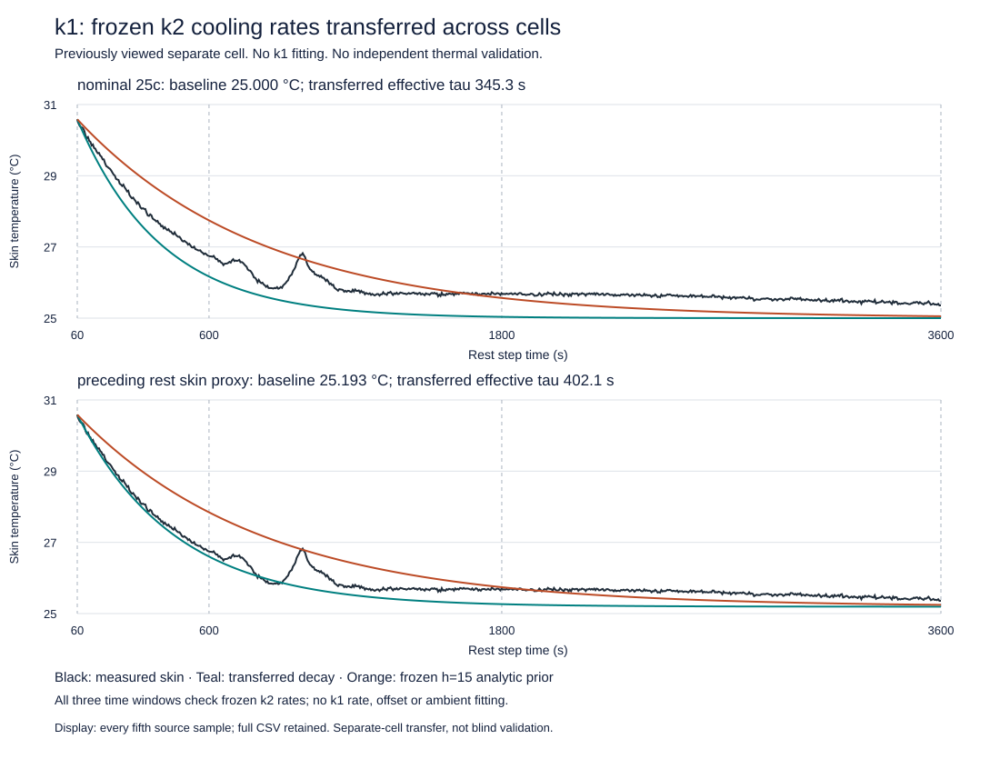

# Cooling improvement on k2 does not transfer uniformly to k1

The frozen k2 decay rates were applied to a separate k1 cooling record with **no
refitting**. Neither scenario improves the frozen prior in all three predeclared
periods. The preceding-rest skin-proxy scenario improves early/middle prediction,
but its late RMSE is0.372844 K versus0.185826 K for the prior, about twice as large.
**Do not replace the DFN's thermal parameters with the k2 fitted decay rate.**
This negative transfer result is part of the research outcome, not a software
failure or a reason to retune the held-out checking record.

## Fixed inputs and separate-cell check

The [protocol](stanford-cooling-transfer-protocol.md) was frozen after the
[k2 characterization](stanford-k2-cooling-findings.md) completed CI. k1 is a
previously viewed cell from the same published campaign, not a new blind specimen.
Its samples were excluded from this iteration's k2 rate calibration. Only the
specified initial/boundary conditions came from k1: interpolated skinT(60 s) and,
for one scenario, the preceding-rest final600 s time-weighted skin mean. No k1
rate, amplitude, offset, ambient or extra model term was optimized.

| Quantity | k2 characterization | k1 transfer episode |
|---|---:|---:|
| Pre-discharge rest skin mean, final600 s |24.367005°C|25.193473°C|
| First post-discharge rest skin sample |32.349742°C|31.138418°C|
| Final recorded post-rest skin sample |24.373240°C|25.358194°C|
| Observed discharge charge, no filled initial interval |4.770869 Ah|4.707801 Ah|

These source conditions differ despite the shared25°C/1C label. Neither equal SOC,
equal manufacturing lot nor an identical fixture/ambient history is established.
Current, full phase summaries and original naive-local dates are retained in the
[normalized source artifact](benchmarks/stanford-k1-cooling-source.json). No
unobserved state history is replayed.

## All predeclared windows, including worsening

Transferred nominal-asymptote tau is345.255910 s; transferred skin-proxy tau is
402.104150 s. The unchanged zero-source analytic prior remains760.553248 s under
its explicitly constant-capacity approximation. The k1 anchor is30.585176°C at60 s.

| Fixed scenario | Check interval | Transferred RMSE | Prior RMSE | Transferred maximum | Transferred signed mean |
|---|---|---:|---:|---:|---:|
| Nominal25°C |60–600 s|0.481889 K|0.777508 K|0.652187 K|−0.452624 K|
| Nominal25°C |600–1800 s|0.657471 K|0.567970 K|1.438840 K|−0.628140 K|
| Nominal25°C |1800–3600 s|0.573002 K|0.364751 K|0.706123 K|−0.566418 K|
| Prior-rest skin proxy25.193473°C |60–600 s|0.126643 K|0.838686 K|0.220671 K|−0.116087 K|
| Prior-rest skin proxy25.193473°C |600–1800 s|0.372412 K|0.674543 K|1.088038 K|−0.312737 K|
| Prior-rest skin proxy25.193473°C |1800–3600 s|0.372844 K|0.185826 K|0.498409 K|−0.364122 K|

Persistence RMSE is2.555582,4.644835 and5.012716 K respectively. Both transferred
rates beat persistence, but the nominal scenario worsens versus the prior in two
periods; the skin-proxy scenario worsens in the late period. Both therefore fail
the frozen **all-period improvement screen**. That screen is descriptive model
comparison, not a newly invented physical acceptance threshold.

All transferred/prior curves still satisfy the inherited2 K RMSE/5 K maximum
thermal-proxy gates in these windows. Passing those broad gates does not establish
that a candidate is better, that the asymptote is physically correct, or that skin
and volume-average temperatures are interchangeable. Original electrical failures
remain unchanged: k1 approximately191.474 mV and k2 approximately55.003 mV against
the50 mV RMSE criterion. This experiment changes neither electrical prediction.

## What this constrains

The simple cooling response identified on one record is not a uniformly better
cross-cell predictor under this protocol. Its overcooling bias on k1 and the
visible nonmonotone temperature excursions challenge transportability of the
combined constant-asymptote/single-decay/skin-proxy assumptions. They do not identify
a unique difference in convection, heat capacity, sensor response, cell aging,
internal gradients or residual electrochemical heat.

A skin-based pre-rest baseline is not a measured ambient trace. Zero recorded
terminal current does not prove zero internal heat generation. No fitted h, intrinsic
h/C or manufactured-cell improvement is inferred. A more flexible curve could fit
this same record better, but that would be a new calibration, not evidence that
these frozen rates transferred successfully.

## Reproducible repository evidence

The repository contains the complete normalized time/temperature arrays for both
k1 rests, including verified zero external current and full source inspection.
Its208,262-byte artifact has SHA256
`9fc12883623a0d5fa47d4c13eed9a37edf40965f8fe0e965cc294772c32c1dc9`.
An independent reviewer parsed the original worksheet XML separately from the
production reader and exactly matched all7,202 time/temperature pairs. The raw
workbook and original archive hashes are pinned in the protocol and JSON.

The fixed k2 characterization JSON is SHA256
`a240791b72e63a1ac1625fecf9cc29f45bbdef2b6f5b26ec36b6a08cc634a782`.
Its remote Git blob`a8ae3dca833e83776f2ce5200e80205913c24235` was verified against
local bytes in the tree of commit`0fb5624e90e670e2e1b21143de84a7d6a1ee13f1`.
This closes the link between the published calibration and the transferred rates.

Run `python scripts/check_stanford_cooling_transfer.py` and
`python scripts/render_stanford_cooling_transfer.py` using the pinned repository
environment. Default reproduction needs only committed files. Optional
`--input-zip` checks the normalized inputs against the original saved archive again.
The recorded run included that exact round-trip and completed in1.111 s under
60 s/1 GB process bounds with one BLAS thread, no download, optimizer or DFN solve.

The [result JSON](benchmarks/stanford-k1-cooling-transfer.json) contains all source,
protocol, implementation and frozen-calibration hashes, metrics, signs, original
condition summaries and gate outcomes. The [prediction CSV](benchmarks/stanford-k1-cooling-transfer-predictions.csv)
preserves every evaluated source knot; display subsampling in the plot is labeled.
Tests explicitly prohibit fitting, reject altered source/calibration identities,
and retain synthetic cases where the transferred rate is worse.

## Evidence-based next decision

The frozen k2 rates fail the predeclared all-window transfer-improvement criterion.
This does not support replacing the thermal prior; no DFN parameter replacement
was tested. A new
thermal-parameter calibration should first obtain a discriminating boundary
constraint: a synchronized ambient/fixture temperature record, or independently
measured heat capacity plus enough surface/core observations to distinguish heat
transfer from internal redistribution. Neither is supplied by these two traces.
A second exponential or arbitrary ambient correction on the same records would
not supply that missing measurement. No such refit or new coupled solve is started.

Useful continuing work can instead test a different independently constrained
model hypothesis or recover an already licensed, provenance-pinned characterization
measurement. Any next candidate must declare its training/check records and
observable before looking for a lower error. These results keep the thermal
limitations visible while research proceeds elsewhere in the battery model.

Measurements and derived arrays: Catenaro and Onori,
[DOI10.17632/kxsbr4x3j2.2](https://data.mendeley.com/datasets/kxsbr4x3j2/2), CC BY4.0.
