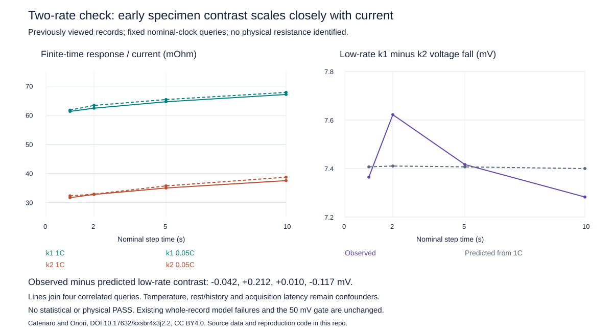

# Two-rate onset screen: the early specimen contrast scales closely with current

The frozen 1C response predicted a low-rate k1−k2 loaded-fall contrast of
**7.400–7.411 mV**. The separately recovered 0.05C record gives **7.283–7.622 mV**.
Observed minus predicted contrast is **−0.042, +0.212, +0.010 and −0.117 mV**
at the predeclared nominal 1.001/2/5/10 s queries, without refitting.

This is descriptive support for a current-proportional early contrast across
approximately 20× current. It is **not identified contact resistance**, a physical
PASS, or a statistical equivalence result. Temperature, rest/history, fixture and
acquisition latency remain unresolved. The original k1 191.474 mV and k2
55.003 mV aggregate failures against 50 mV remain unchanged.



## Frozen prediction and source recovery

The [protocol](stanford-cross-rate-onset-protocol.md) was independently reviewed
before recovery or calculation. The k1 low-rate record had already been catalogued
and summarized; this is a post-hoc characterization, not a fresh blind holdout.
The existing high-rate response D/I at each fixed time is used without optimization
to predict that cell's low-rate voltage fall, using its actual low-rate current.
The between-cell prediction uses both individual currents, not a substituted
common current.

The one official request recovered `NMC_k1_0_05C_25degC.xlsx`, exactly 6,096,861
bytes, SHA256 `e5870c6989c94995de10e053f04efcf96951790e3c26e51d4c537261ba847ec5`.
Recovery took 15.40 s within the frozen 120 s/1 GB bound; inflated size
34,684,956 bytes passed the existing 50 MB workbook guard. The committed
[acquisition receipt](benchmarks/stanford-cross-rate-acquisition.json) records
that single attempt, source identity, license, timestamps and protocol hash.

All 3,601 original rest and 70,000 discharge rows were qualified before retaining
all rest rows and the 10 initial discharge rows needed to support the queries.
Every retained value, timestamp and original worksheet index was independently
checked against the original workbook. Both full-phase and retained-slice clock
audits are preserved. Existing normalized sources supply the other three records.

Catenaro and Onori,
[Mendeley DOI 10.17632/kxsbr4x3j2.2](https://data.mendeley.com/datasets/kxsbr4x3j2/2),
[CC BY 4.0](https://creativecommons.org/licenses/by/4.0/).

## Every individual prediction is retained

D is the last-rest voltage minus loaded voltage. I is positive discharge current,
obtained by negating the original negative source current. The frozen prediction
is Dpred_low = (D_high/I_high) × I_low. Voltage and current are interpolated
separately on supported adjacent samples before taking their ratio.

| Nominal time (s) | k1 low observed (mV) | k1 low predicted (mV) | k1 difference (mV) | k2 low observed (mV) | k2 low predicted (mV) | k2 difference (mV) |
|---|---:|---:|---:|---:|---:|---:|
| 1.001 | 15.436 | 15.327 | +0.109 | 8.072 | 7.920 | +0.151 |
| 2 | 15.841 | 15.603 | +0.238 | 8.219 | 8.193 | +0.027 |
| 5 | 16.346 | 16.156 | +0.190 | 8.929 | 8.749 | +0.180 |
| 10 | 16.960 | 16.782 | +0.178 | 9.677 | 9.382 | +0.295 |

Individual relative differences are 0.71–1.53% for k1 and 0.32–3.15% for k2.
These percentages describe the prediction errors, not measurement uncertainty.
No accuracy budget has been established to grade these sub-millivolt differences
statistically. Four query times from the same records are correlated observations,
not four independent experimental replicates.

| Nominal time (s) | High-rate response contrast (mΩ) | Low-rate response contrast (mΩ) | Low minus high interaction (mΩ) |
|---|---:|---:|---:|
| 1.001 | 29.621 | 29.452 | −0.169 |
| 2 | 29.634 | 30.481 | +0.846 |
| 5 | 29.621 | 29.659 | +0.039 |
| 10 | 29.592 | 29.123 | −0.469 |

These are differences in finite-time apparent voltage response per ampere, not
fitted or identified resistor values. Both individual response transfer errors
and the interaction are preserved, so agreement in a difference cannot hide
large individual errors that cancel in the contrast.

## Timing, temperature and missing history

The new record's first supported time is 1.001 s, so the frozen common-support
rule moves the earlier 1.0006 s query to 1.001 s for all four records. Queries
at 2/5/10 s are unchanged. Nothing is extrapolated into the unobserved initial
interval. Recorded rest/load sample brackets, naive timestamps, original row
indices and interpolation neighbors are in the result JSON. Instrument/filter
latency and true switching time are unknown; nominal command-clock alignment
does not establish simultaneous physical onset.

Measured onset-current ranges, including the first supporting sample at or after
10 s, are:

| Record | Positive current range (A) |
|---|---:|
| k1 1C | 5.000240–5.000288 |
| k1 0.05C | 0.250037–0.250041 |
| k2 1C | 5.000378–5.000414 |
| k2 0.05C | 0.250019–0.250022 |

The observed currents are nearly constant over these retained windows; this does
not measure the earlier switching transient. Instantaneous D/I transfer remains
a conditional descriptor of potentially different current histories.

At corresponding queries, k1 is 0.795–0.831 K warmer than k2 at 1C and
0.705–0.753 K warmer at 0.05C. Within each specimen, low-rate skin is cooler by
0.128–0.166 K for k1 and 0.022–0.069 K for k2. Internal temperatures are not
measured. All four rest anchors and both 10/60 s drift summaries are retained;
rest-tail variation is not an uncertainty estimate or proof of equilibrium.

The earlier low-rate records end before their respective high-rate records begin:

| Cell | Low-rate end, naive source time | High-rate start, naive source time | Unobserved gap (s) |
|---|---|---|---:|
| k1 | 2019-08-31 21:51:21.088 | 2019-09-02 19:10:54.152 | 163173.064 |
| k2 | 2019-08-31 21:41:12.806 | 2019-09-02 19:11:01.133 | 163788.327 |

No timezone is supplied by the source and no history is replayed across these
roughly 45-hour gaps. Similar rest voltage does not certify equal inventory,
absolute SOC, state of health or fixture contact across records.

## Reproduction and scientific use

```sh
OPENBLAS_NUM_THREADS=1 OMP_NUM_THREADS=1 python scripts/check_stanford_cross_rate.py --out results/cross-rate-check
python scripts/render_stanford_cross_rate.py
pytest -q tests/test_cross_rate_response.py
```

All calculation inputs are committed and checksum-pinned. Reproduction needs no
network, fitting or physical solve. The bounded calculation took about 0.24 s
within 60 s/1 GB. The original workbook preparation recipe and exact acquisition
receipt remain available for independent source verification.

The result strengthens a current-proportional description of the early
between-specimen contrast, while leaving its physical location and cause open.
It is useful for specifying a subsequent controlled comparison or characterization
measurement, not for silently adding a contact resistor or claiming a validated
improvement. A physical attribution would require independently constrained
fixture/contact, synchronized acquisition and cell state, plus appropriate pulse
or relaxation evidence. No parameter or model acceptance gate is changed here.

Validation before publication: 599 local tests passed, 7 skipped; lint and format
checks passed. Eight added tests cover proportional and nontransferring cases,
current imbalance, zero denominators, input/support rejection, exact source hashes
and no-download/no-solve reproduction.
