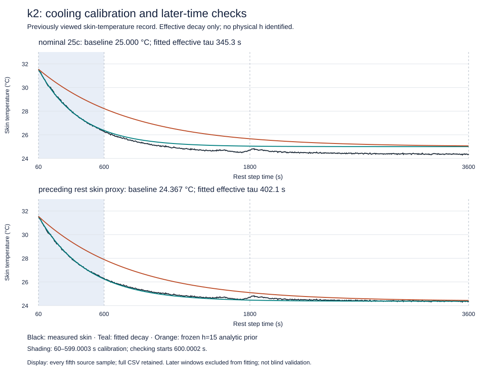

# A measured cooling transient constrains the thermal-boundary approximation

A frozen, independently reviewed, cached-data experiment now estimates an effective
skin-temperature decay time and checks its later predictions. It improves that
observable's prediction over the existing frozen thermal prior, while exposing a
structural problem with treating the nominal chamber label as the skin-temperature
asymptote. **This is characterization of one previously viewed record; no DFN
parameter has been changed and no independent thermal validation is claimed.**

## Predeclared calibration and later checks

The [protocol](stanford-k2-cooling-protocol.md) fixes one scalar fit per ambient
scenario, no fitted offset/amplitude, and two later check intervals. Original source
knots end calibration at599.0003 s and start checking at600.0002 s; the0.9999 s gap
is retained to prevent interpolating a checking observation into calibration.
The60 s anchor is interpolated using calibration-side observations. All later data
are excluded from fitting, but analysts had previewed the record, including the
thermal tail. This is not a blinded experiment or a fresh holdout specimen.

The preceding rest's time-weighted final600 s mean is24.367005°C. It is a skin-based
baseline proxy available before the discharge, not an independent ambient sensor.
The nominal25°C scenario remains separately reported without rescue adjustment.

| Fixed asymptote scenario | Fitted effective decay time | Calibration RMSE | Early check RMSE | Late check RMSE |
|---|---:|---:|---:|---:|
| Nominal25°C |345.256 s|0.044475 K|0.350922 K|0.561151 K|
| Preceding-rest skin proxy24.367°C |402.104 s|0.043367 K|0.097195 K|0.106490 K|

Early checking spans600.0002–1800 s; late checking spans1800–3600 s. The frozen
analytic prior uses the existing Stanford h=15 W/m²/K, cooling area0.00531 m² and
ORegan effective total thermal capacity60.578066 J/K evaluated at298.15 K. Its
zero-source, constant-capacity decay time is760.553 s. This is explicitly an
analytic prior comparison, not the full DFN's temperature-dependent thermal solve.
ORegan's package default h=10 is not silently substituted for the Stanford override.

| Scenario | Prior early/late RMSE | Fitted early/late max error | Fitted early/late mean signed error |
|---|---:|---:|---:|
| Nominal25°C |1.589859 /0.802792 K|0.565512 /0.706266 K|+0.329353 /+0.552974 K|
| Preceding-rest skin proxy |1.141952 /0.211012 K|0.248987 /0.382991 K|−0.089343 /−0.067174 K|

Persistence at the60 s measured temperature gives6.509484 /7.090967 K RMSE.
Both fitted scenarios improve both comparators in both later windows and stay
inside the numerical search interval. This satisfies only the protocol's relative
screen for further study. All fitted/prior later checks satisfy the inherited
2 K RMSE/5 K maximum thermal-proxy gates, **including the nominal-asymptote model
known to miss the tail**. Those broad gates do not demonstrate an adequate cooling
model, instrument uncertainty or independent thermal validation.

## What the data establish and what remains unresolved

The final recorded skin temperature is24.373240°C. Starting above25°C, any positive
single-exponential decay toward25°C remains above25°C. Its endpoint error therefore
exceeds0.626760 K regardless of the fitted decay rate. This is a descriptive
incompatibility of the combined nominal-ambient/one-node/skin approximation, not
proof of a uniquely incorrect sensor, chamber, heat capacity or cooling coefficient.

A previously recorded rise during the earliest seconds and later residual structure
also caution against interpreting the scalar as pure convection. External current
is zero, but internal relaxation heat, core-to-skin redistribution, fixture paths,
ambient drift and thermocouple response are not separately measured. Neither h nor
an intrinsic h/C is identified. We do not convert the fitted time into a measured
heat-transfer coefficient. The plot's later small excursions are retained, not
filtered away or fitted by extra terms.

The fitted skin-proxy scenario demonstrates that a separately specified effective
thermal response can predict later samples substantially better than the published
prior approximation. It does not establish that this rate transfers to loaded
operation or that changing thermal parameters improves voltage. Historical k2
voltage RMSE55.003054 mV still fails the unchanged50 mV requirement.

## Reproduction and engineering checks

Run with one BLAS thread and an external60 s/1 GB address-space cap:
`python scripts/characterize_stanford_k2_cooling.py`, then
`python scripts/render_stanford_k2_cooling.py`.
The measured analysis time was0.302 s; no workbook download or electrochemical
solve occurred. The [JSON](benchmarks/stanford-k2-cooling.json) pins protocol,
implementation and archived-input hashes, both scenarios, actual intervals,
all comparator metrics and provenance. The [full prediction CSV](benchmarks/stanford-k2-cooling-predictions.csv)
retains measured samples and both scenarios' curves.

Per-segment8-point versus32-point quadrature differed by at most7.11e−15 K² in MSE.
Residual extrema include within-segment stationary points. Independent synthetic
review checked the algebra and caught the fractional-clock split leakage before
any real fitting; regression tests now ensure even large changes after600 s cannot
alter fitted parameters. The original source and previous scientific evidence are
unchanged.

## Next scientific increment

A separate cooling episode can test cross-cell transfer without a new download.
Read-only archive reconciliation found the complete k1/25°C/1C workbook inside
`current-source-k1-inputs-37887926852.zip` (archive SHA256
`c777b934ed13ed02aac194c045e7582b8032820e2706867517aa92911d2477a9`).
Its member `files/data/stanford/raw/NMC_k1_1C_25degC.xlsx` is1,868,963 bytes,
SHA256`b42a2ad343be13d6baba84ebf149ef79876ef719a067b8dcc8d4f7da9de124f6`,
matching the previously authenticated source. It was absent as a loose checkout
file, not irretrievable. A next protocol can freeze transfer of both k2 fitted
rates, use only k1 prior-rest baseline and60 s amplitude, and score its later
cooling without refitting. k1 is a previously viewed cross-cell check, not a
new blind specimen. Other summary-only records cannot substitute for full traces.

In parallel, any eventual loaded-temperature counterfactual must distinguish a
skin proxy from the DFN volume average and retain electrochemical/thermal coupling.
No new coupled solve or fitted h is justified merely by this one-tail improvement.

## Relation to battery development

Industrial development links materials/process settings to measured electrode
structure, then characterizes cells, calibrates identifiable quantities and tests
complete separate operating records. [Lu et al. (2020)](https://www.nature.com/articles/s41467-020-15811-x)
use measured3D microstructure to connect calendering, pore structure and transport;
our commercial-cell data do not supply that manufacturing map. This increment
therefore improves the characterization/validation stage, rather than claiming to
simulate slurry coating, drying, calendering, formation or manufacture a better cell.
The [PyBaMM thermal model](https://docs.pybamm.org/en/v26.6.0.0/source/examples/notebooks/models/thermal-models.html)
provides the stated heat-balance prior, whose parameter transfer remains conditional.

Original measurements and derived temperature series: Catenaro and Onori,
[DOI10.17632/kxsbr4x3j2.2](https://data.mendeley.com/datasets/kxsbr4x3j2/2), CC BY4.0.
