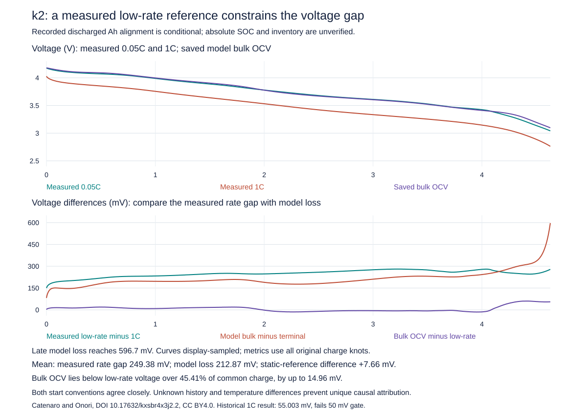

# k2 low-rate voltage reference: conditional constraint, not a fitted model

The independently measured 0.05C waveform is close to the archived model bulk-OCV
curve on a conditional equal-recorded-Ah alignment. The larger discrepancy lies
between the measured low/high-rate voltage separation and the model's
bulk-to-terminal voltage loss. This is useful evidence for designing a loaded
polarization comparison, but it does not identify a faulty kinetic parameter.
Temperatures, initial inventory and unobserved history differ or are unknown.
The historical 1C voltage RMSE remains **55.003054 mV, FAIL at 50 mV**.



## Frozen protocol and source

The [protocol](stanford-k2-low-rate-protocol.md) was independently reviewed before
recovering or examining the waveform. The public file had previously been
selected and summarized in the history audit; this is not a fresh blind holdout.

Catenaro and Onori, [Mendeley version 2](https://data.mendeley.com/datasets/kxsbr4x3j2/2),
DOI 10.17632/kxsbr4x3j2.2, [CC BY 4.0](https://creativecommons.org/licenses/by/4.0/).
The exact official `NMC_k2_0_05C_25degC.xlsx` request recovered 6,029,678 bytes,
SHA256 `6bfaeb45fe90b76b6bd5973f0cb481b5d42db81cd2729e9be44121b44296d174`,
in 12.37 s. Inflated size 34,361,075 bytes passed the existing 50 MB guard.
The acquisition used one request within 120 s/1 GB, without an alternate source.

The full workbook inspection found 91,415 rows and the canonical six phases.
All 70,370 consecutive discharge rows, including original row numbers and naive
timestamps, are retained in the committed normalized source. No row was selected
by voltage error, discarded, averaged or fitted. Recorded discharge is 4.887153244 Ah.
Source arrays, inspection, hashes and acquisition receipt are committed alongside
this report. The preparation script can independently reconstruct the normalization
from the checksum-verified original workbook.

## Results on the common supported charge interval

Both declared start conventions are reported; neither was chosen based on outcome.
All quantities below are charge-weighted diagnostics of the piecewise-linear
V(q) interpolants, not a replacement for the historical time-weighted gate.

| Full-interval quantity | Recorded start | Command-start hold |
|---|---:|---:|
| Common charge interval (Ah) | 0–4.628304108 | 0.001389412–4.629693519 |
| Mean bulk OCV minus low-rate voltage S (mV) | +7.660 | +7.984 |
| Mean low-rate minus 1C measured voltage G (mV) | +249.380 | +249.056 |
| Mean model bulk-to-terminal loss P (mV) | +212.869 | +212.869 |
| Mean model terminal residual R=S+G−P (mV) | +44.171 | +44.171 |
| Minimum S (mV) | −14.963 | −14.716 |
| Charge fraction with S<0 | 45.4111% | 45.3071% |
| Charge with S<−1e−10 V (Ah) | 2.101763 | 2.096953 |

The arithmetic identity closes exactly at stored binary64 evaluation. An
independent integration oracle reproduced full-interval and quarter statistics
to within 7.8e−16. This arithmetic check is distinct from the original DFN voltage
accounting closure and from agreement with experiment.

For the primary recorded-start convention, four equal common-charge quarters give:

| Quarter | S mean (mV) | G mean (mV) | P mean (mV) | R mean (mV) |
|---|---:|---:|---:|---:|
| 1 | +13.207 | 217.293 | 176.999 | +53.501 |
| 2 | +7.590 | 247.339 | 195.703 | +59.226 |
| 3 | −7.634 | 269.970 | 204.130 | +58.207 |
| 4 | +17.475 | 262.918 | 274.644 | +5.749 |

The first three quarters' measured between-record gap exceeds modeled loss by
40.294, 51.636 and 65.840 mV. In the last quarter, the model loss grows sharply;
its endpoint reaches 596.740 mV and the terminal residual reaches −262.800 mV.
Quarter averages must not conceal that endpoint reversal. These descriptive
quarters introduce no extra acceptance gates.

## What the comparison does and does not establish

Equal passed Ah is a convention, not evidence of equal absolute SOC. The 0.05C
record ends at naive 2019-08-31T21:41:12.806; the 1C record starts at naive
2019-09-02T19:11:01.133. The intervening 163788.327 s / 45.4967575 h are unobserved.
No state replay bridges this gap. Command-start hold adds only the explicitly
assumed first-current interval, not the missing inter-experiment history.

The archived bulk OCV uses the model's 1C temperature and published electrode
inventory. It is not a measured low-rate equilibrium curve. Low-rate skin spans
24.192–25.158 °C on common support; high-rate skin spans 24.385–31.656 °C;
model bulk spans 24.408–36.476 °C. Aligned high-rate skin minus low-rate skin averages
4.350 K. Model bulk minus low-rate skin averages 5.871 K and ranges about
+0.040 to +12.006 K. Skin and volume-average temperature are different observables.
Consequently G is a **between-record voltage difference**, not isolated rate
polarization at matched thermal and inventory states.

If matched inventory, valid OCP/thermal/history assumptions and nonnegative
loaded polarization held, bulk OCV would be an upper reference to loaded low-rate
voltage. The observed negative S intervals challenge that conjunction. With no
experimental uncertainty or verified matched inventory, they do not uniquely
falsify OCP, identify kinetics/diffusion, or justify a resistance correction.
The small full-interval mean S also does not prove the OCP curve is correct.
Every negative interval's width and minimum is retained in the JSON.

Common support covers 94.7035% of the low-rate recorded charge and 97.0118% of
1C recorded charge. It excludes the final 0.258849 and 0.142565 Ah respectively.
These unmodeled tails are not awarded successful validation.

## Reproduction and next discriminating constraint

From the repository root, run:

```sh
OPENBLAS_NUM_THREADS=1 OMP_NUM_THREADS=1 python scripts/check_stanford_k2_low_rate.py --out results/k2-low-rate-check
python scripts/render_stanford_k2_low_rate.py
pytest -q tests/test_low_rate_reference.py
```

All comparison inputs are committed; no network or physical solve is needed.
The script regenerates dense prediction CSVs from original charge knots. Those
redundant derived CSVs are not committed; their receipt hashes describe this run.
The normalized measured source, full diagnostic summary and plot are committed.
The bounded analysis took about 6.06 s within 60 s/1 GB. No DFN solve, parameter
fit, threshold adjustment or physical parameter promotion occurred.

A useful next constraint is independently established starting inventory/SOC
and temperature/history equivalence for the two discharges, or a near-equilibrium
OCV curve with uncertainty. Existing CC/CV and rest endpoints may bound protocol
consistency but cannot certify absolute electrode inventory across the unknown
gap. Until those constraints are available, the evidence supports a conditional
loaded-voltage discrepancy and a jointly inconsistent upper-reference assumption,
not a unique corrective parameter. Preserve this negative/limited finding for
future characterization and independent validation design.

Implementation review additionally requires zero duplicate/reversed discharge
clocks, command-origin consistency within 1e-6 s, and the existing 1 s date/test
clock qualification. These are clock-integrity guards, not physical error gates.
The observed command-origin variation is 7.28e-12 s; whole-record relative
date/test discrepancy is 0.003596 s. All original discharge dates increase.

Validation at publication: 568 local tests passed, 7 skipped; all lint and format
checks passed. The 18 added tests cover arithmetic, invalid records, clock
qualification, immutable inputs and solve/download-free reproduction.
