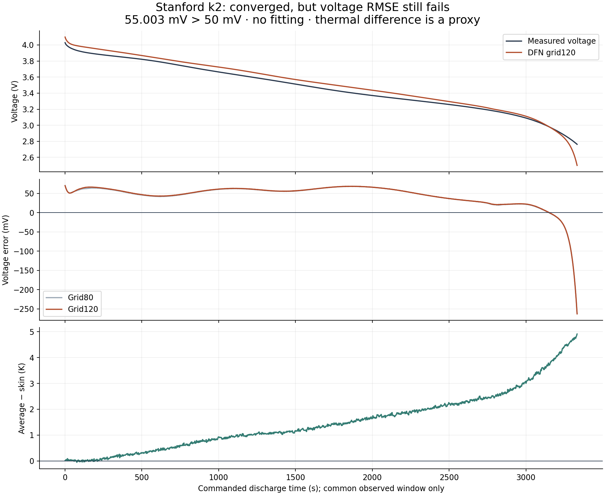

# k2 residual audit: broad voltage bias, then early cutoff

**The empirical failure is spread across the discharge, not confined to its final
spike.** This post-hoc analysis uses only already committed recovery arrays and
residuals. It performs no source download, model solve, fitting, smoothing,
threshold change or extrapolation. Fine-grid RMSE remains **55.003054 mV: FAIL**.

## Where the discrepancy accumulates

Error means predicted minus measured voltage. On grid120 it begins at +70.113 mV,
stays positive until **3152.943 s**, then becomes negative for the final
**180.189 s**, ending at −262.800 mV. The long positive interval contributes
**86.1023% of total integrated squared error**; the negative tail contributes
13.8977%. The model event is 102.639 s earlier than the measured endpoint.

For a reproducible descriptive partition, divide the full measured duration into
four equal quarters and clip only the final quarter at the actual model event:

| Measured-duration quarter | Common interval (s) | RMSE (mV) | Share of squared error |
|---|---:|---:|---:|
| 1 | 1.000–859.693 | 54.071 | 24.9044% |
| 2 | 859.693–1718.386 | 59.797 | 30.4584% |
| 3 | 1718.386–2577.079 | 56.978 | 27.6542% |
| 4, truncated by model event | 2577.079–3333.132 | 47.586 | 16.9830% |

These are post-hoc localization statistics, **not additional acceptance gates**.
All archived knots and the exact squared piecewise-linear integral are retained.
The quarters partition the unchanged full score; no observed tail is silently
discarded from the official capacity, energy or coverage calculations. Signed
mean error is +44.171 mV, but no offset was fitted or removed. A constant voltage
offset alone cannot reproduce both signs of this nonconstant residual.

## What is and is not identifiable

Numerical refinement changes maximum voltage by 3.362 mV and RMSE by 0.494 mV;
the empirical discrepancy persists after the frozen spatial check passes. This
supports a case-specific failure under the stated model/input assumptions. It
does not uniquely identify resistance, kinetics, diffusion, initial inventory,
thermal coupling or the measurement setup.

The archive retains global voltage, charge, temperature, lithium, heating,
cooling and heat-capacity trajectories, plus extrema of native concentrations.
It does **not** retain electrode-state or polarization-component time series.
Their contributions and transition times cannot be recovered from these extrema.
The older cell790 polarization diagnostic belongs to a different case.

The fixed uniform-state OCV differs from the pre-rest measured endpoint by only
−5.792 mV. That terminal-voltage agreement does not establish equilibrium or equal
electrode inventories. The first measured loaded point occurs at 1.0003 s;
its residual is not an instantaneous resistance measurement. Existing boundary
diagnostics already mix finite-delay polarization, state and instrumentation.

## Constitutive-law support is narrower than physical bounds

- Fine-grid saved surface stoichiometry reaches x_n=0.038868 and x_p=0.995579,
  outside the released exchange-current sampled envelopes 0.1585–1.0000 and
  0.2598–0.8499. Their crossing times/durations remain unknown because only
  extrema were saved. These envelopes are not OCP validity domains.
- Model temperature starts 0.595432 K below the 25°C heat-capacity measurement
  lower bound and crosses 25°C at approximately 97.746 s.
- Model temperature exceeds the positive coating-conductivity nominal 35°C
  support boundary at approximately 3163.496 s and reaches 36.476457°C. That
  measurement was near x_p≈0.9; concentration dependence and applicability at
  initial x_p≈0.270 remain unestablished.
- The last two crossing times are linear interpolations of saved model outputs,
  not measured material-breakdown times. They do not prove causation. In
  particular, the broad positive voltage error predates the 35°C crossing.

Support ranges come from the existing [parameter-support audit](benchmarks/oregan-parameter-support.json)
and [kinetics provenance](oregan-kinetics-provenance.md). Actual k2 extrema come
from its own recovery snapshot, not the older audit's k1 trajectory.

Predicted volume-average temperature increasingly exceeds the measured skin
proxy, ending +4.912810 K at cutoff. h=15 remains an unmeasured fixture prior;
nominal ambient and uniform initial temperature are assumptions. Neither passing
thermal-proxy gates nor internal heat balance establishes independent thermal
validation or universal material-law validity.

## Limited cross-cell comparison

The saved k1 and k2 mesh120 predictions share identical core scientific-code and
dependency hashes. Their voltages differ by at most **2.815201 mV** over their
shared model-time interval, despite different actual current waveforms and
initial temperatures. Their observed-window errors differ substantially
(191.473522 mV for k1; 55.003054 mV for k2), with nonidentical measurement windows.
This is a descriptive comparison of conditional predictions, not an isolated
temperature experiment, causal improvement, blinded test or population result.
The prior k1 residual-thirds report uses mesh80 and is not relabeled as mesh120.

## What would resolve the missing causal information

Distinguishing initial inventory/OCV from kinetic, transport and fixture effects
would require independently constrained initial electrode state, high-rate
boundary measurements with instrumentation timing characterized, and measured
thermal boundary/internal-versus-skin information. A future explicitly frozen
model diagnostic could retain electrode states and voltage components; that
would describe the model's mechanism, not by itself identify real-cell causation.
**None of those new measurements, acquisitions or simulations is launched here.**

This one audit ends with the existing empirical FAIL and no fitted correction.
The original lost execution remains unknown; k6 history contrast and the k1,
Chen and ORegan failures remain unchanged.

## Reproduce without a solve

`python scripts/audit_stanford_k2_residuals.py` writes the complete machine-readable
audit. [Saved audit](benchmarks/stanford-k2-residual-audit.json) pins source hashes,
integration rules, partitions and comparison limitations. Rendering is optional:
`--render-only` uses already available matplotlib and the same archived curves;
no package installation is required for the analysis. The figure was rendered
with existing system packages; no source data were fetched.
