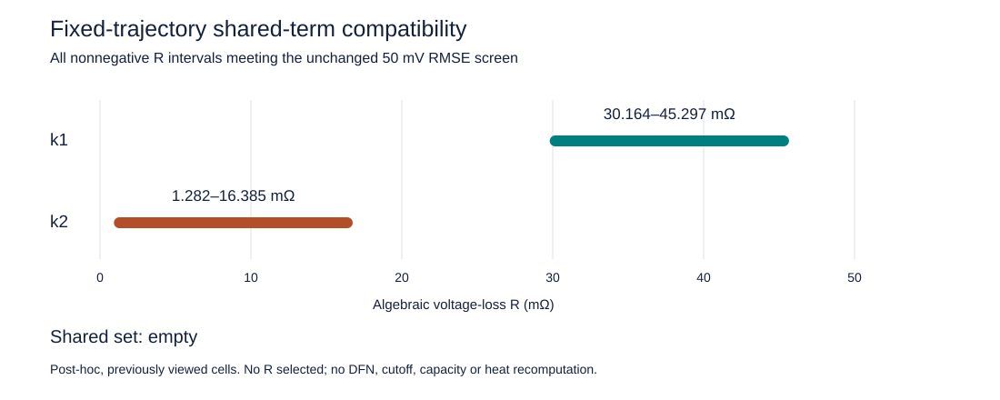

# One shared series-like voltage term cannot satisfy both frozen records

The independently reviewed, predeclared screen found **no common nonnegative R**
that makes the two archived voltage residuals satisfy the unchanged50 mV RMSE
criterion after algebraically subtracting I(t)R. The k1 feasible interval is
30.164–45.297 mΩ; k2 permits1.282–16.385 mΩ. Their13.779 mΩ separation is far larger
than numerical roundoff.

This is a negative **fixed-trajectory shared-term compatibility** result. No R
was selected or installed, no measured voltage was altered and no physical
resistor/DFN counterfactual was simulated. Existing electrical validation failures
remain failures.

## Exact criterion and complete result

For each cell on its original common interval, e=V_model−V_measured and I is the
positive original discharge current. The [protocol](stanford-series-loss-protocol.md)
asks whether E(R)=mean[(e−IR)²]≤0.050² with R≥0. The exact piecewise-linear product
integrals give E(R)=AR²−2BR+C. No optimizer, trial resistor grid, chosen correction
or changed threshold is involved.

| Cell | A: mean I² (A²) | B: mean eI (V·A) | C: mean e² (V²) | Complete nonnegative feasible R set |
|---|---:|---:|---:|---:|
| k1 |25.0032503931|0.9433743088|0.03666210951|[30.163614,45.296519] mΩ|
| k2 |25.0037054803|0.2208703943|0.003025335970|[1.282314,16.384699] mΩ|

The intersection is empty. The lower k1 endpoint exceeds the upper k2 endpoint by
13.778915 mΩ. Individual numerical root guards are approximately4.0e−15 Ω and
6.4e−16 Ω; they concern floating-point arithmetic, **not** experimental uncertainty
or confidence intervals for a measured resistance.

The four measured-duration quarters, with the last clipped only at the original
model event, are all retained in the [JSON](benchmarks/stanford-series-loss-compatibility.json).
They are descriptive partitions, not newly imposed acceptance gates. The primary
decision uses each complete original common interval. The current is integrated
at its actual recorded values, not replaced by the nominal5 A label or averaged
by sample count.

## Identity, initial state, capacity and clocks were checked first

Both source records are published single-cell INR21700-M50 campaign specimens,
identified separately as k1 and k2. They are not parallel/series pack traces. A
shared manufacturing lot, fixture resistance, channel calibration or voltage-sense
location is not established. The equality of R across specimens is the tested
additional assumption, not known experimental metadata.

| Original condition | k1 | k2 |
|---|---:|---:|
| Mean observed discharge current magnitude |5.000325 A|5.000371 A|
| Observed discharged charge |4.707801 Ah|4.770869 Ah|
| Skin-based uniform initial-temperature assumption |25.187941°C|24.404568°C|
| First observed commanded discharge time |1.0006 s|1.0003 s|
| Original common score endpoint/model event |3333.176217 s|3333.132326 s|
| Measured discharge endpoint |3390.3968 s|3435.7713 s|
| Measured tail beyond the model event |57.220583 s|102.638974 s|
| Original observed-duration coverage |98.3117765%|97.0117666%|
| Uncorrected voltage RMSE |191.473522 mV|55.003054 mV|

Both models retain published initial concentrations28866 mol/m³ negative and
13975 mol/m³ positive. These are not independently measured initial electrode
inventories or SOC for the two Stanford cells. Their nearby pre-rest voltages do
not identify equal inventories, and observed discharge Ah is not an equilibrium
capacity or SOH measurement. The zero-current rest records remain finite rests,
not proven equilibrium. A series-like term is zero at zero current, so it cannot
repair any independent rest/inventory/OCP discrepancy.

The source date/test and commanded-step clocks passed their fixed checks. Dates
remain original naive-local timestamps with unspecified timezone. No time shift,
capacity alignment, measured-tail removal or initial-state retuning was used.
The unobserved first approximately1 s still leaves switching dynamics unresolved.
These roughly constant5 A records also poorly distinguish a resistance-like term
from a constant voltage offset within an individual discharge.

## What is ruled out, and what is not

One shared nonnegative algebraic voltage-loss term is insufficient to satisfy both
fixed-record RMSE requirements. Existing sign changes already ruled out exact
constant-offset cancellation; this screen adds the stronger, quantitative answer
about the prescribed nonzero50 mV tolerance and cross-record overlap.

The result does **not** show that actual contact resistance is absent, that cell
resistance is uniquely wrong, or that separate fitted resistors would be valid.
The [authors' pulse-front resistance observable](https://pangea.stanford.edu/ERE/pdf/OnoriPDF/Journals/60.pdf)
and the [LG specification's finite-duration DC resistance test](https://www.dnkpower.com/wp-content/uploads/2019/02/LG-INR21700-M50-Datasheet.pdf)
include different state, timing and cell-response conditions. Neither is an
independently measured missing fixture contribution for this screen. We do not
subtract those published values from each other or use them to bound this R.

A physical added resistance could change heat deposition and trigger voltage
cutoff earlier; its location matters. This calculation changes neither trajectory
nor event. Individual algebraic feasibility is therefore **not a corrected
simulation PASS** and does not certify capacity, energy, maximum error, thermal
response, missing-tail coverage or transport physics. Cell-specific state,
polarization and instrumentation hypotheses remain distinguishable only with
additional independent constraints.

## Reproducibility and verification

The committed normalized input
[stanford-series-loss-inputs.json.gz](benchmarks/stanford-series-loss-inputs.json.gz)
contains all3988 k1 and3992 k2 union knots, residuals, actual currents, conditioning,
full source inspection and provenance. It is123235 bytes, SHA256
`5ea98848b8759550fb92f21cac74a1edf8ddbc8b284285c3a42cfcd862cd4d8c`.
The normalizer verified k1 exported observations directly against its original
workbook, and k2 against the previously row-verified source CSV. It also checked
archived forcing and reconstructed residuals. Original baseline RMSEs reproduced
within1e−12 V before the new screen.

k1 uses replay37887926852/source744794b02, whose fine voltage CSV is byte-identical
to its preserved historical curve. k2 retains recovery37871885149/source50c73ba
as explicitly historical evidence. This new analysis does not certify a new k2
solve or silently update the scientific-source identity.

Run `python scripts/check_stanford_series_loss.py` and
`python scripts/render_stanford_series_loss.py` in the pinned environment.
Default reproduction uses only committed files. The recorded evaluation took
0.023 s under an external60 s/1 GB cap and one BLAS thread, with zero source
acquisitions or electrochemical solves. Exact polynomial products were checked
against three-point Gauss integration; full-interval coefficient differences were
1.39e−17 for k1 and4.34e−19 for k2. Synthetic tests use an independent
exact-rational polynomial integral and cover current/time scaling, signs,
zero excitation, boundary roots and propagated numerical ambiguity. No ambiguity
bound widens the physical50 mV criterion.

## Next discriminating electrical work

Neither a common thermal-response replacement nor this shared voltage term is
supported by the completed transfer/compatibility checks. Adding separate free
parameters to the same two viewed records would not independently explain them.
A useful next constraint is the already catalogued same-cell low-rate record,
NMC_k2_0_05C_25degC.xlsx, whose known SHA256 is
`6bfaeb45fe90b76b6bd5973f0cb481b5d42db81cd2729e9be44121b44296d174`.
First locate an authenticated full archived copy; its existing summary alone
cannot supply an OCV-versus-charge curve. Any recovery/acquisition requires its
own bounded source/protocol step before new analysis.

That record could constrain a separately declared low-rate/full-cell voltage
comparison without fitting k2's1C error. It still would not be equilibrium OCV,
an electrode-specific measurement or continuous history: the previously documented
45.497 h unobserved gap prohibits carrying state between the files. No low-rate
curve, unique cause, new calibration or successful improvement is invented here.

Measurements and derived artifacts: Catenaro and Onori,
[DOI10.17632/kxsbr4x3j2.2](https://data.mendeley.com/datasets/kxsbr4x3j2/2), CC BY4.0.
