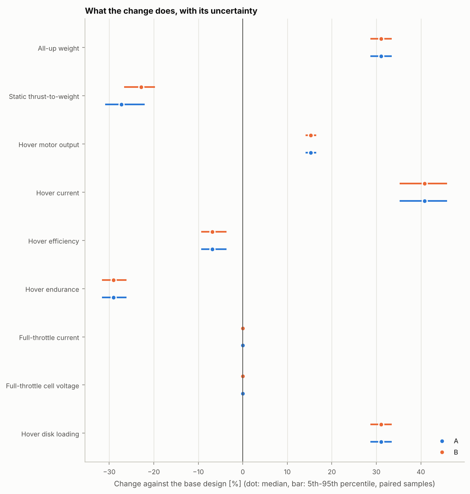
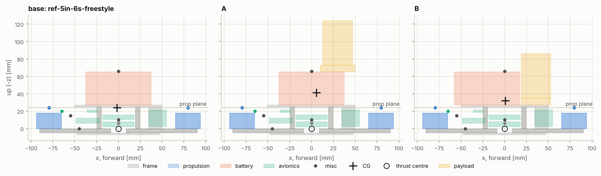
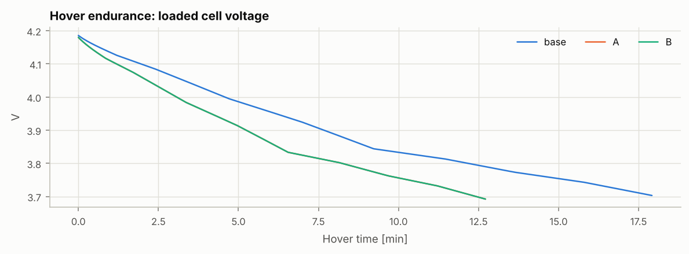
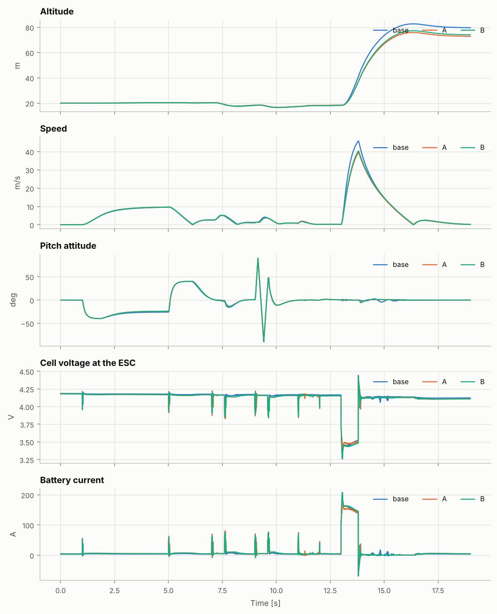
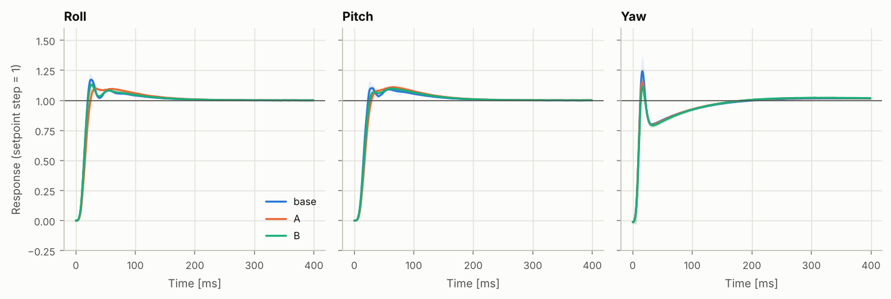

# 設計迭代比較報告

> 由 `fpvsim compare` 自動產生。所有版本用相同的設定分析：同一個隨機種子、相同的蒙地卡羅樣本數、同一份規格、相同的飛控設定與飛行腳本。蒙地卡羅是**成對**的：在第 i 組樣本中，各版本共有的零件（同一個零件檔、同樣數值的參數）取相同的值，所以差異是逐組直接算出來的，不受兩次獨立抽樣的雜訊干擾。但共有零件仍會影響變更的**大小**（例如槳的效率決定了多 165 g 要多耗多少電），所以差異的區間也包含它們的不確定度，見第 3 節的敏感度分析。

| 代號 | 版本 | 設計檔 | 相對基準的變更（演進順序） | 輸入檔雜湊 |
|---|---|---|---|---|
| base | 參考機：5 吋 6S freestyle（通用零件） | `data/builds/ref-5in-6s-freestyle.toml` | 基準設計 | `d19981aac9bd` |
| A | 版本 A：運動相機綁在電池前端 | `data/builds/ref-5in-6s-freestyle-actioncam-a.toml` | 加掛全尺寸運動相機（綁在電池前端），電池位置不變 | `63ed371dfdc4` |
| B | 版本 B：相機裝在上板前端、電池後移 | `data/builds/ref-5in-6s-freestyle-actioncam-b.toml` | 加掛全尺寸運動相機（上板前端），電池後移 20 mm | `2ceaf83a31c3` |

| 項目 | 內容 |
|---|---|
| 規格 | 5 吋 6S freestyle 設計規格（範例）（`freestyle-5in-6s`），所有版本相同 |
| 飛控設定 | 5 吋 Acro 基準設定（`acro-5in-baseline`），所有版本相同 |
| 蒙地卡羅 | 每個版本 1000 組成對樣本，隨機種子 1 |
| 飛行腳本 | `freestyle`：綜合飛行：10 m/s 前飛、滾轉翻、後空翻、原地自轉、衝刺、收油下墜 |
| 程式版本 | fpvsim 0.1.0，git `ee299fd072af（工作區有未提交的修改）` |
| 產生時間 (UTC) | 2026-10-07 23:44 |

## 摘要

- **A（版本 A：運動相機綁在電池前端）**：全備重量 +165 g（+31.0%），懸停續航 -29.1%（90% 區間 -31.6% 至 -26.1%），推重比 -27.3%，重心偏移 5.7 mm。新增不符合的規格：R1、R6。有風險：R2。
- **B（版本 B：相機裝在上板前端、電池後移）**：全備重量 +165 g（+31.0%），懸停續航 -29.1%（90% 區間 -31.6% 至 -26.1%），推重比 -22.9%，重心偏移 1.0 mm。新增不符合的規格：R1。有風險：R2。
- 在變更後的版本中，**B 符合的規格最多**（4 / 6 項）。
- 所有變更後的版本都不符合 R1（全備重量）。若這條規格是為變更前的用途訂的，應先決定是放寬它，還是為新用途另訂規格；這是產品決策，不是工程問題。
- **控制：** 用相同的基準增益，滾轉超調在基準為 19.9%，A 11.8%、B 14.4%。轉動慣量變大，同樣的增益等於較低的迴路增益，所以超調變小。各版本自己的調參建議見第 7 節。

## 1. 設計變更

**A** 相對基準設計：

| 類型 | 項目 | 變更前 | 變更後 |
|---|---|---|---|
| 新增零件 | `action_camera` | — | 153 g @ (30.0, 0.0, -98.5) mm |
| 新增零件 | `camera_mount` | — | 12 g @ (30.0, 0.0, -69.0) mm |

**B** 相對基準設計：

| 類型 | 項目 | 變更前 | 變更後 |
|---|---|---|---|
| 新增零件 | `action_camera` | — | 153 g @ (36.0, 0.0, -60.5) mm |
| 新增零件 | `camera_mount` | — | 12 g @ (36.0, 0.0, -31.0) mm |
| 移動 | `battery` | (0.0, 0.0, -46.0) mm | (-20.0, 0.0, -46.0) mm |

## 2. 規格符合度

每格為符合機率（判定）。判定：≥ 95% 符合，50–95% 有風險，< 50% 不符合；與門檻相差不到兩倍蒙地卡羅標準誤差時標為「臨界」，換一個隨機種子可能落在另一邊。零件的安裝位置有標示不確定度時（例如電池與相機的 `position_u`），重心相關的機率已包含它。

| 編號 | 需求 | base | A | B |
|---|---|---|---|---|
| R1 | 全備重量 | > 99.7%（符合） | < 0.3%（不符合） | < 0.3%（不符合） |
| R2 | 靜態推重比（滿電、全油門、含重心配平） | > 99.7%（符合） | 86.6% ± 1.1%（有風險） | 93.6% ± 0.8%（有風險（臨界）） |
| R3 | 懸停油門（馬達輸出，滿電） | > 99.7%（符合） | > 99.7%（符合） | > 99.7%（符合） |
| R4 | 懸停續航 | > 99.7%（符合） | > 99.7%（符合） | > 99.7%（符合） |
| R5 | 全油門槳尖馬赫數 | 99.2% ± 0.3%（符合） | 99.2% ± 0.3%（符合） | 99.2% ± 0.3%（符合） |
| R6 | 重心與推力中心的水平偏移 | 97.3% ± 0.5%（符合） | 32.0% ± 1.5%（不符合） | 99.7% ± 0.2%（符合） |

## 3. 性能對照

標稱值為各版本所有參數取標稱值的結果。差異欄是**成對**樣本的差（版本減基準）：中位數與 90% 區間；百分比指標的差以百分點表示。下圖是同樣的差異換算成相對變化。

| 指標 | base 標稱值 | A 標稱值 | B 標稱值 | A − base（P5 – P95） | B − base（P5 – P95） |
|---|---|---|---|---|---|
| 全備重量 | 532 g | 697 g | 697 g | +165 g（+153 – +175） | +165 g（+153 – +175） |
| 重心與推力中心的水平偏移（大小；方向見第 4 節） | 1.8 mm | 5.7 mm | 1.0 mm | +3.8 mm（-1.2 – +7.5） | -0.7 mm（-3.4 – +2.2） |
| 靜態推重比（滿電、全油門、含重心配平） | 13.20 | 9.62 | 10.18 | -3.48（-4.96 – -2.49） | -2.96（-4.25 – -2.18） |
| 懸停油門（馬達輸出，滿電） | 20.2% | 23.3% | 23.3% | +3.1 個百分點（+2.7 – +3.5） | +3.1 個百分點（+2.7 – +3.5） |
| 懸停總電流（滿電） | 3.24 A | 4.55 A | 4.55 A | +1.30 A（+0.89 – +1.89） | +1.30 A（+0.89 – +1.89） |
| 懸停效率 | 6.54 gf/W | 6.11 gf/W | 6.11 gf/W | -0.44 gf/W（-0.64 – -0.24） | -0.44 gf/W（-0.64 – -0.24） |
| 懸停續航 | 17.92 min | 12.73 min | 12.73 min | -5.15 min（-7.24 – -3.75） | -5.15 min（-7.24 – -3.75） |
| 全油門總電流（滿電） | 161.7 A | 161.7 A | 161.7 A | +0.0 A（+0.0 – +0.0） | +0.0 A（+0.0 – +0.0） |
| 全油門單芯電壓（滿電） | 3.49 V | 3.49 V | 3.49 V | +0.00 V（+0.00 – +0.00） | +0.00 V（+0.00 – +0.00） |
| 懸停槳盤負載 | 98.9 Pa | 129.6 Pa | 129.6 Pa | +30.7 Pa（+28.5 – +32.6） | +30.7 Pa（+28.5 – +32.6） |

### 差異的敏感度

每次只把一個參數移動 ±1σ，看差異（版本減基準）改變多少。共有參數在兩個版本同時移動，和成對抽樣一致。列出對續航差與推重比差影響最大的參數：

**A**：

| 差異 | 參數 | 屬於 | 對差異的影響 (±1σ) |
|---|---|---|---|
| 懸停續航 | `prop.ct_scale` | 共有 | ±0.54 min |
| 懸停續航 | `prop.cp_scale` | 共有 | ±0.48 min |
| 懸停續航 | `motor.i0_speed_fraction` | 共有 | ±0.35 min |
| 懸停續航 | `motor.i0_ref` | 共有 | ±0.34 min |
| 靜態推重比（滿電、全油門、含重心配平） | `battery.offset_x` | 共有 | ±0.40 |
| 靜態推重比（滿電、全油門、含重心配平） | `prop.ct_scale` | 共有 | ±0.36 |
| 靜態推重比（滿電、全油門、含重心配平） | `battery.r0_cell` | 共有 | ±0.26 |
| 靜態推重比（滿電、全油門、含重心配平） | `prop.cp_scale` | 共有 | ±0.25 |

**B**：

| 差異 | 參數 | 屬於 | 對差異的影響 (±1σ) |
|---|---|---|---|
| 懸停續航 | `prop.ct_scale` | 共有 | ±0.54 min |
| 懸停續航 | `prop.cp_scale` | 共有 | ±0.48 min |
| 懸停續航 | `motor.i0_speed_fraction` | 共有 | ±0.35 min |
| 懸停續航 | `motor.i0_ref` | 共有 | ±0.34 min |
| 靜態推重比（滿電、全油門、含重心配平） | `battery.offset_x` | 共有 | ±0.38 |
| 靜態推重比（滿電、全油門、含重心配平） | `prop.ct_scale` | 共有 | ±0.30 |
| 靜態推重比（滿電、全油門、含重心配平） | `battery.r0_cell` | 共有 | ±0.22 |
| 靜態推重比（滿電、全油門、含重心配平） | `prop.cp_scale` | 共有 | ±0.21 |

## 4. 質量、重心與慣性

| 版本 | 全備重量 | 重心偏移（前 + / 右 +） | 重心高於槳平面 | Ixx / Iyy / Izz (g·m²) | Ixz (g·m²) | 阻力面積 x / y / z (cm²) |
|---|---|---|---|---|---|---|
| base | 532 g | -1.8 / +0.1 mm | +0.1 mm | 1.372 / 1.564 / 2.450 | +0.009 | 60 / 80 / 180 |
| A | 697 g | +5.7 / +0.1 mm | +17.2 mm | 2.141 / 2.409 / 2.662 | +0.298 | 93 / 96 / 205 |
| B | 697 g | +1.0 / +0.1 mm | +8.2 mm | 1.629 / 2.072 / 2.833 | +0.113 | 93 / 96 / 205 |

- 重心高於槳平面時，前飛的槳盤阻力作用在重心下方、指向後方，會產生**低頭**力矩，傾向加大前傾；零件自己的阻力（例如相機）作用在零件位置，裝得越高，前飛時的抬頭力矩越大。兩者都由飛控修正，且都已包含在飛行模擬中。
- Ixz 是滾轉與偏航之間的慣性積（張量形式），不為零時兩軸的運動會互相耦合；裝在高處且偏前的零件會讓它變大。
- 槳葉間隙檢查通過：沒有零件位於槳盤範圍內且離槳平面不到 10 mm。

## 5. 懸停續航

| 版本 | 懸停續航 | 結束原因 | 懸停電流 | 懸停油門 |
|---|---|---|---|---|
| base | 17.92 min | 達到保留電量 | 3.24 A | 20.2% |
| A | 12.73 min | 達到保留電量 | 4.55 A | 23.3% |
| B | 12.73 min | 達到保留電量 | 4.55 A | 23.3% |

懸停續航只取決於重量與動力系統，與重心位置無關，所以重量相同的版本續航相同。

## 6. 飛行測試對照

相同的飛控設定（基準增益）、相同的飛行腳本與隨機種子。**這是每個版本一次、所有參數取標稱值的飛行，沒有不確定度。**阻力面積、槳盤阻力係數、ESC 電流限制與振動等參數只影響這一節；它們的不確定度還沒有傳遞到飛行結果。

| 項目 | base | A | B |
|---|---|---|---|
| 前飛段末速度 | 9.4 m/s | 9.5 m/s | 9.5 m/s |
| 前飛段末傾角 | 26.1 ° | 24.1 ° | 24.2 ° |
| 滾轉翻掉高度 | 2.56 m | 2.74 m | 2.84 m |
| 後空翻掉高度 | 1.77 m | 1.64 m | 1.70 m |
| 原地自轉平均角速度 | 605 deg/s | 605 deg/s | 606 deg/s |
| 衝刺 2 秒內爬升高度 | 55.2 m | 48.5 m | 49.6 m |
| 最大爬升速度 | 45.8 m/s | 39.6 m/s | 40.3 m/s |
| 最低單芯電壓 | 3.26 V | 3.31 V | 3.27 V |
| 最大電流 | 208 A | 195 A | 203 A |
| 用電量 | 54 mAh | 61 mAh | 62 mAh |
| 滾轉追蹤誤差 (RMS) | 33.2 deg/s | 37.9 deg/s | 34.8 deg/s |
| 俯仰追蹤誤差 (RMS) | 36.1 deg/s | 41.5 deg/s | 39.1 deg/s |
| 混控飽和時間 | 0.6% | 0.7% | 0.6% |

前飛段末傾角：重量變大但阻力增加較少時，維持同樣速度需要的傾角反而較小。

## 7. 控制響應與調參

圖中是所有版本都用**基準增益**時的步階響應，取自各版本調參研究中的基準候選。調參飛行的每一軸都有固定時間的小幅度步階（不讓混控飽和），步階的時刻已知，所以直接在每一次步階量測，不必反卷積；表中是 12 次步階的中位數，括號為四分位距。陰影是各次步階之間的標準差。

| 版本 | 滾轉超調 | 俯仰超調 | 偏航超調 | 上升時間（滾 / 俯） | 未安定的軸 | 調參建議 | 建議 P-D（滾轉 / 俯仰） |
|---|---|---|---|---|---|---|---|
| base | 19.9%（0.6%） | 14.5%（1.3%） | 32.6%（5.0%） | 10 / 11 ms | — | PD×1.3 D×1 | 52-39 / 55-43 |
| A | 11.8%（2.3%） | 10.7%（0.9%） | 22.9%（4.9%） | 13 / 14 ms | — | PD×1.3 D×1 | 52-39 / 55-43 |
| B | 14.4%（3.0%） | 10.4%（1.0%） | 17.7%（4.6%） | 11 / 13 ms | — | PD×1.3 D×1 | 52-39 / 55-43 |

建議值落在掃描範圍邊緣的有：base（PD）、A（PD）、B（PD），下一輪應往該方向擴大掃描。

## 8. 下一步

1. 決定 R1 是否適用於變更後的用途，必要時另訂規格，再用新規格重跑本比較。
2. 最影響版本差異的估計值（第 3 節敏感度）：`prop.ct_scale` — 推力台量測靜態推力，以 `fpvsim fit-prop` 辨識 Ct；`prop.cp_scale` — 推力台量測扭矩（或電流與轉速），以 `fpvsim fit-prop` 辨識 Cp；`motor.i0_speed_fraction` — 無槳空載測試，至少兩個電壓；`battery.offset_x` — 量測實際安裝位置（每次安裝）；`battery.r0_cell` — 脈衝放電測試（HPPC）量測瞬間與極化壓降。
3. 第 6 節的飛行結果另外取決於阻力面積與槳盤阻力係數（`prop.rotor_drag_factor`），它們只能由飛行測試辨識（定速平飛的傾角對速度、滑行減速）；目前飛行結果沒有不確定度。
4. 採用的版本依第 7 節的建議重新調參後，再飛一次比較。

## 9. 方法與限制

- 成對蒙地卡羅：每個參數的亂數流由（種子，零件身分）決定：零件檔的參數以零件檔的 id 為身分，其他參數以名稱、數值與不確定度為身分。所以同一個零件在各版本的第 i 組樣本中取值相同；換了零件或改了數值，就視為不同的物品，誤差彼此獨立。
- 差異的區間包含共有參數的影響：它們不會被成對抽樣消去，因為變更的效果大小本身就取決於它們（見第 3 節敏感度）。
- 阻力以零件疊加估計：機架的阻力作用在重心，零件的阻力作用在零件位置；零件之間的干擾與相機傾角對阻力的影響未計。
- 相機視為剛性安裝；TPU 軟座的振動隔離與畫面果凍效應不在模型內。相機在前槳上方時對進氣的遮擋也未計。
- 陀螺儀振動模型的振幅沿用基準設計。實際上同樣的不平衡力作用在較大的慣性上，角速度振動會較小，所以變更後版本的雜訊估計偏保守。
- 推重比只計入維持水平所能用的推力：重心偏離推力中心時，靠近重心那側的馬達先到滿載。
- 所有版本使用同一份規格；若版本的規格不同，`fpvsim compare` 會拒絕比較。
