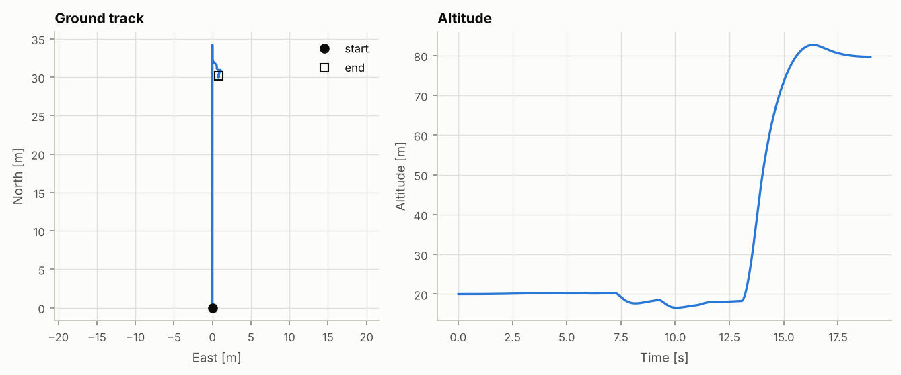
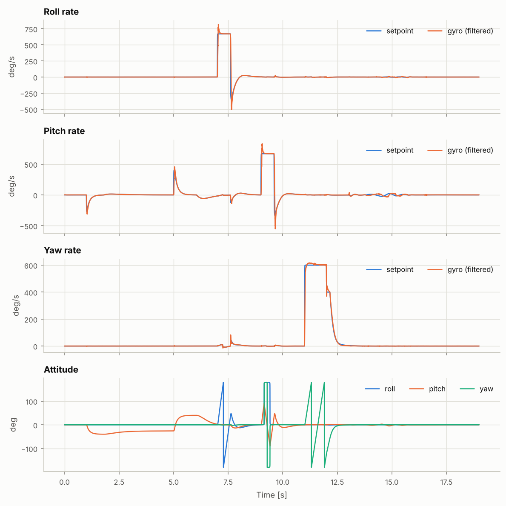
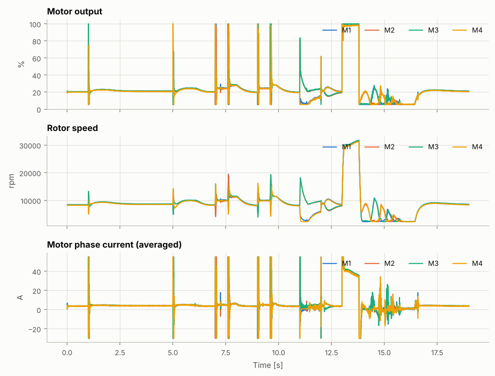
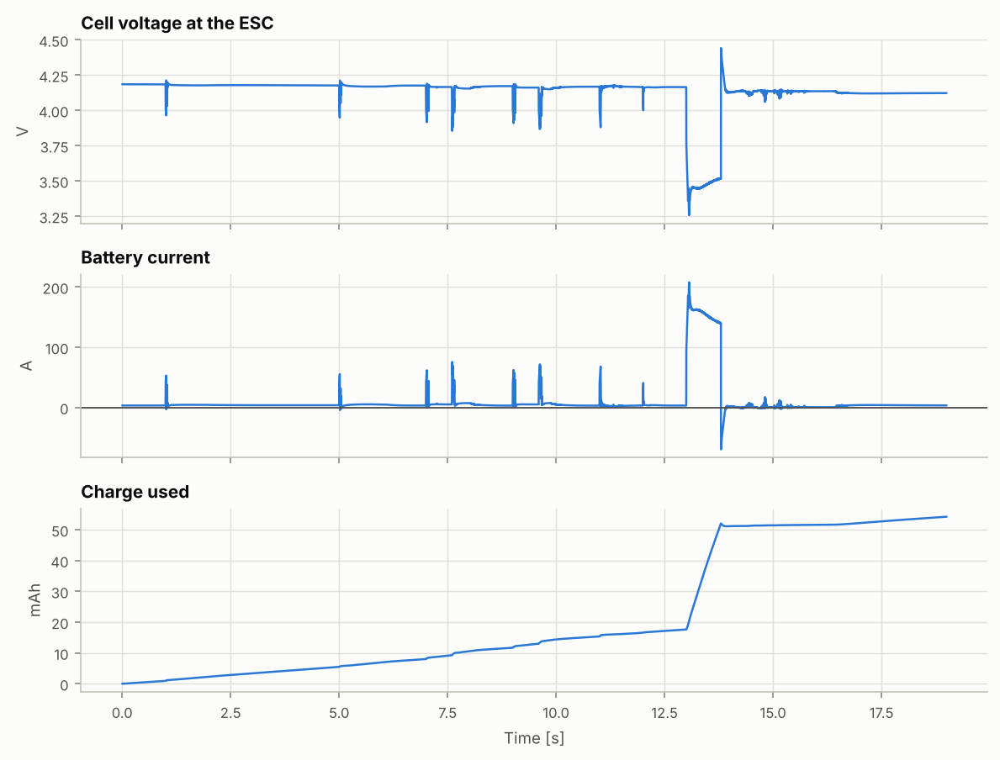
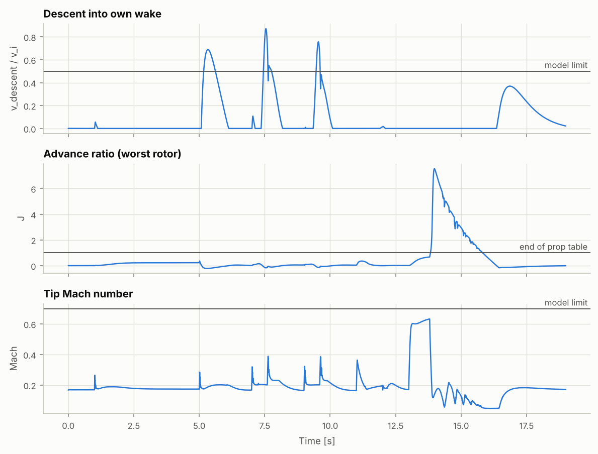

# 飛行測試報告：綜合飛行：10 m/s 前飛、滾轉翻、後空翻、原地自轉、衝刺、收油下墜（`freestyle`）

> 由 `fpvsim fly` 自動產生。原始 log 在 `flight_log.csv`（欄位格式見 docs/flight-sim.md）。

| 項目 | 內容 |
|---|---|
| 機體 | 參考機：5 吋 6S freestyle（通用零件）（`data/builds/ref-5in-6s-freestyle.toml`） |
| 飛控設定 | 5 吋 Acro 基準設定（`acro-5in-baseline`） |
| 輸入 | `freestyle` |
| 程式版本 | fpvsim 0.1.0，git `f0fa48cda647（工作區有未提交的修改）` |
| 輸入檔雜湊 | `d19981aac9bdba93` |
| 隨機種子 | 1 |
| 更新率 | 物理 8000 Hz，陀螺儀 8000 Hz，PID 4000 Hz，記錄 1000 Hz |
| 產生時間 (UTC) | 2026-10-07 23:25 |

## 摘要

| 項目 | 數值 |
|---|---|
| 飛行時間 | 19.0 s |
| 最大速度（三維 / 水平） | 45.8 / 9.6 m/s（165 / 35 km/h） |
| 最大爬升 / 下降速度 | 45.8 / 4.8 m/s |
| 高度範圍（起始 20 m） | 16.6 – 82.7 m |
| 最大傾角 | 180° |
| 最大角速度（滾轉 / 俯仰 / 偏航） | 797 / 821 / 615 deg/s |
| 最低單芯電壓（ESC 端） | 3.26 V |
| 最大 / 最小電流 | 208 / -70 A（負值為煞車回充） |
| 用電量 | 54 mAh，1.21 Wh |
| 剩餘電量 | 96% |

- 觸地最大速度 0.00 m/s，未墜機（門檻 3 m/s）。

## 1. 姿態控制

| 軸 | 追蹤誤差 (RMS) | 延遲（互相關） | 最大命令角速度 |
|---|---|---|---|
| 滾轉 | 33.2 deg/s | 22 ms | 670 deg/s |
| 俯仰 | 36.1 deg/s | 21 ms | 670 deg/s |
| 偏航 | 11.1 deg/s | 9 ms | 600 deg/s |

## 2. 馬達與動力

## 3. 模型適用範圍監測

模擬器會記錄飛行是否離開物理模型的適用範圍。超出範圍的片段，數值只能當作定性參考。

| 狀況 | 時間占比 | 首次發生 | 影響 |
|---|---|---|---|
| 下降進入自身尾流（下降速度 > 0.5 倍懸停誘導速度） | 4.7% | 5.17 s | 動量理論在此失效，渦環狀態與 propwash 未建模；這段的推力與抖動不可信 |
| 前進比超出槳係數表（J ≥ 1） | 10.5% | 13.83 s | 槳係數以表格最後一點外插，推力估計不可信 |
| 槳尖馬赫數 > 0.7 | 0.0% | — | 未計入壓縮性，推力與扭矩偏樂觀 |
| 混控飽和 | 0.6% | 1.00 s | 馬達已到 0% 或 100%，姿態控制能力受限；不是模型問題，是飛行限制 |
| 接觸地面 | 0.0% | — | 接地模型為簡化的彈簧阻尼與庫侖摩擦 |

## 4. 這次模擬沒有包含的東西

- 下降進入自身尾流時的渦環狀態與 propwash 抖動（只監測，不模擬）
- 機架彈性與共振；振動只進入陀螺儀量測，不影響剛體運動
- 槳在斜向氣流中的非軸向效應（只計入軸向前進比與槳盤阻力）
- 自動測試飛手只是測試工具，不代表人類飛手的反應與習慣
