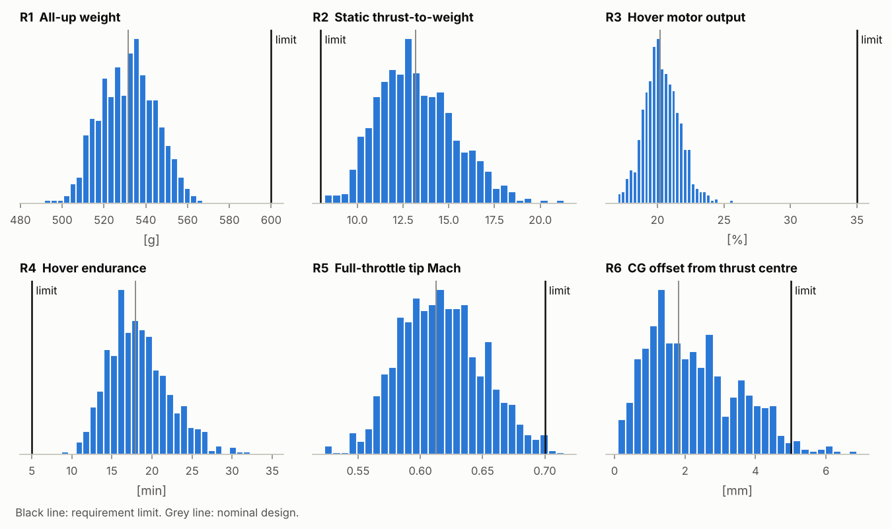
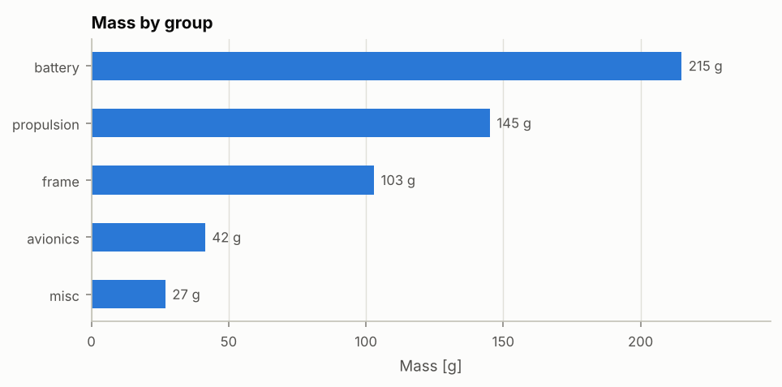
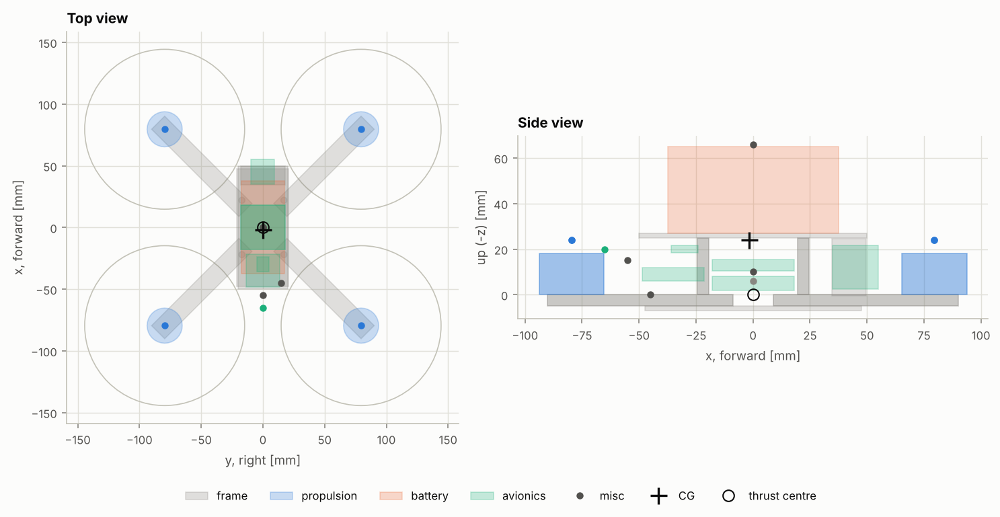
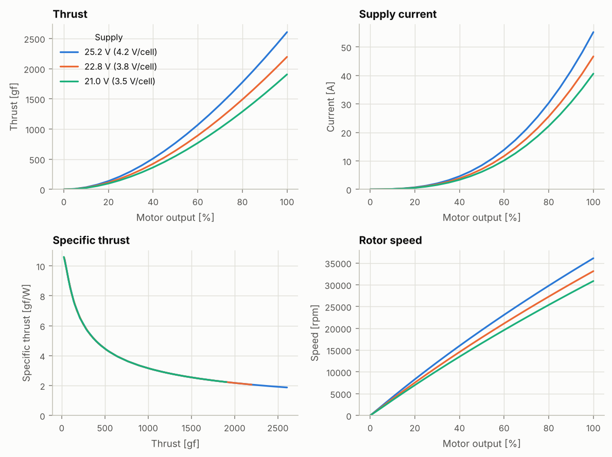
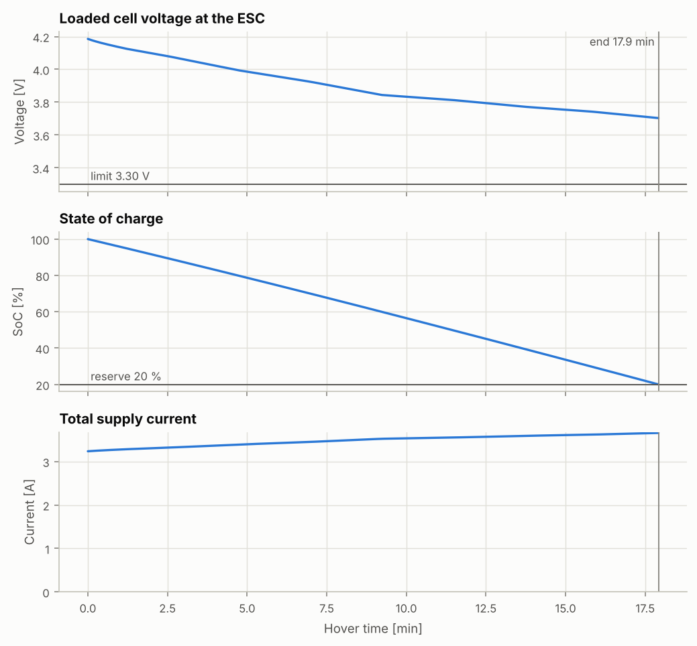
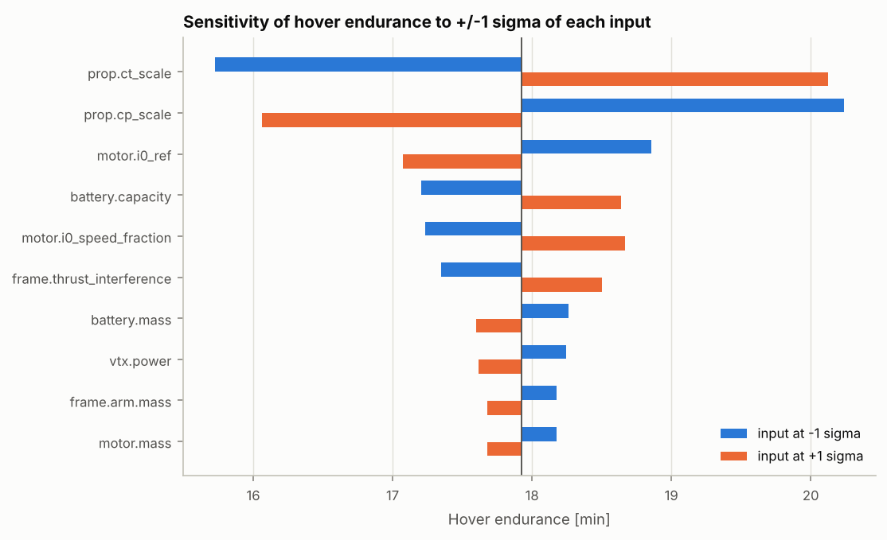
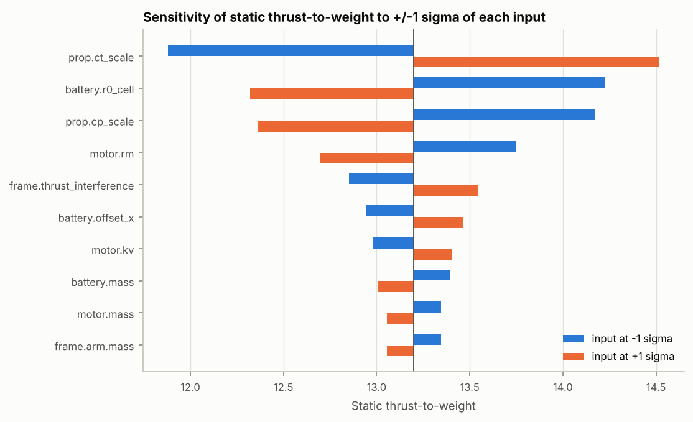

# 設計報告：參考機：5 吋 6S freestyle（通用零件）

> 由 `fpvsim report` 自動產生，請勿手動修改。所有數字都能追溯到 `data/` 下的輸入檔；用同一個 commit、同一組輸入與同一個隨機種子重跑，會得到相同結果。

| 項目 | 內容 |
|---|---|
| 設計檔 | `data/builds/ref-5in-6s-freestyle.toml` |
| 規格 | 5 吋 6S freestyle 設計規格（範例）（`freestyle-5in-6s`） |
| 程式版本 | fpvsim 0.1.0，git `f0fa48cda647（工作區有未提交的修改）` |
| 輸入檔雜湊 (SHA-256) | `d19981aac9bdba93` |
| 蒙地卡羅 | 1000 組樣本，隨機種子 1 |
| 環境 | 氣壓高度 0 m，氣溫 15.0 °C，空氣密度 1.2250 kg/m³ |
| 產生時間 (UTC) | 2026-10-07 23:24 |

## 摘要

以通用零件級距數據組成的參考機，用來建立研發流程與驗證工具。所有零件數據都是標示來源的估計值，不代表任何特定產品。

- 全備重量 **532 g**，靜態推重比 **13.20**，懸停馬達輸出 **20.2%**，懸停續航 **17.92 min**（標稱值）。
- 6 項規格中，有 6 項在不確定度下的符合機率達 95% 以上（見第 1 節）。
- 額定值檢查有 電池放電電流 超標（見第 6 節）。
- **可信度：** 70 個參數中有 80% 是工程估計或模型推導，沒有任何實測值（工程估計 54、標稱值 12、標準值 2、模型推導 2）。因此本報告是**設計階段的預測**：它已通過程式驗證（verification），但尚未用實測數據確認（validation）。第 7 節列出最值得先量測的參數。

## 1. 規格符合度

符合機率是蒙地卡羅樣本中滿足需求的比例，± 為抽樣標準誤差；所有樣本都符合時，以 95% 信心的單邊界限表示（三法則：失敗機率 < 3/n）。判定：≥ 95% 為「符合」，50–95% 為「有風險」，< 50% 為「不符合」；與門檻相差不到兩倍標準誤差時標為「臨界」，換一個隨機種子可能落在另一邊。

| 編號 | 需求 | 門檻 | 標稱值 | 90% 區間 (P5–P95) | 符合機率 | 判定 |
|---|---|---|---|---|---|---|
| R1 | 全備重量 | ≤ 600 g | 532 g | 511 – 553 g | > 99.7% | 符合 |
| R2 | 靜態推重比（滿電、全油門、含重心配平） | ≥ 8 | 13.20 | 10.17 – 17.03 | > 99.7% | 符合 |
| R3 | 懸停油門（馬達輸出，滿電） | ≤ 35% | 20.2% | 18.2 – 22.5% | > 99.7% | 符合 |
| R4 | 懸停續航 | ≥ 5 min | 17.92 min | 12.89 – 25.51 min | > 99.7% | 符合 |
| R5 | 全油門槳尖馬赫數 | ≤ 0.7 | 0.613 | 0.566 – 0.673 | 99.2% ± 0.3% | 符合 |
| R6 | 重心與推力中心的水平偏移 | ≤ 5 mm | 1.8 mm | 0.5 – 4.6 mm | 97.3% ± 0.5% | 符合 |

- **R1**：不掛運動相機的 5 吋 freestyle 機常見的重量上限
- **R2**：freestyle 動作與救機需要足夠的推力餘裕
- **R3**：懸停油門越低，姿態控制可用的推力差越大
- **R4**：懸停續航是上限值；實際花式飛行會明顯更短
- **R5**：超過約 0.7 後壓縮性使效率下降、噪音上升；本模型也未計入壓縮性，超過即超出適用範圍
- **R6**：重心偏離推力中心會讓懸停時前後馬達負載不均



## 2. 關鍵性能

標稱值使用所有參數的標稱值；P5、P50、P95 來自蒙地卡羅。

| 指標 | 標稱值 | P5 | P50 | P95 |
|---|---|---|---|---|
| 全備重量 | 532 g | 511 g | 532 g | 553 g |
| 不含電池重量 | 317 g | 300 g | 316 g | 333 g |
| 重心與推力中心的水平偏移 | 1.8 mm | 0.5 mm | 2.1 mm | 4.6 mm |
| 靜態推重比（滿電、全油門、含重心配平） | 13.20 | 10.17 | 13.01 | 17.03 |
| 懸停油門（馬達輸出，滿電） | 20.2% | 18.2% | 20.2% | 22.5% |
| 懸停油門（搖桿位置，扣除 idle） | 15.6% | 13.5% | 15.6% | 18.0% |
| 懸停轉速 | 8361 rpm | 7664 rpm | 8381 rpm | 9260 rpm |
| 懸停總電流（滿電） | 3.24 A | 2.32 A | 3.24 A | 4.43 A |
| 懸停電功率（滿電） | 81.2 W | 58.2 W | 81.3 W | 111.1 W |
| 懸停效率 | 6.54 gf/W | 4.82 gf/W | 6.55 gf/W | 9.16 gf/W |
| 懸停續航 | 17.92 min | 12.89 min | 17.97 min | 25.51 min |
| 全油門總電流（滿電） | 161.7 A | 133.2 A | 160.0 A | 197.5 A |
| 全油門單顆馬達電流 | 40.3 A | 33.2 A | 39.9 A | 49.3 A |
| 全油門放電倍率 (C) | 124 | 100 | 123 | 153 |
| 全油門單芯電壓（滿電） | 3.49 V | 3.25 V | 3.49 V | 3.77 V |
| 全油門槳尖馬赫數 | 0.613 | 0.566 | 0.616 | 0.673 |
| 懸停槳盤負載 | 98.9 Pa | 95.0 Pa | 99.0 Pa | 102.9 Pa |

## 3. 質量預算

全備重量 **532 g**，不含電池 **317 g**。機體座標為 FRD（x 前、y 右、z 下），原點在馬達安裝面的馬達中心。



| 零件 | 分組 | 質量 | 占比 | 不確定度 (1σ) | 來源 |
|---|---|---|---|---|---|
| battery | battery | 215.0 g | 40.4% | ±8 g | 工程估計 |
| motor ×4 | propulsion | 128.0 g | 24.1% | ±1.5 g 每件 | 工程估計 |
| arm ×4 | frame | 60.0 g | 11.3% | ±1.5 g 每件 | 工程估計 |
| prop ×4 | propulsion | 17.2 g | 3.2% | ±0.3 g 每件 | 工程估計 |
| hardware | frame | 12.0 g | 2.3% | ±3 g | 工程估計 |
| esc | avionics | 12.0 g | 2.3% | ±1 g | 工程估計 |
| xt60_pigtail | misc | 11.0 g | 2.1% | ±2 g | 工程估計 |
| bottom_plate | frame | 10.0 g | 1.9% | ±1 g | 工程估計 |
| top_plate | frame | 9.0 g | 1.7% | ±1 g | 工程估計 |
| standoff ×4 | frame | 8.0 g | 1.5% | ±0.3 g 每件 | 工程估計 |
| camera | avionics | 8.0 g | 1.5% | ±1 g | 工程估計 |
| fc | avionics | 7.0 g | 1.3% | ±1 g | 工程估計 |
| vtx_antenna | avionics | 7.0 g | 1.3% | ±2 g | 工程估計 |
| vtx | avionics | 6.0 g | 1.1% | ±1 g | 工程估計 |
| battery_strap | misc | 6.0 g | 1.1% | ±1 g | 工程估計 |
| wiring | misc | 6.0 g | 1.1% | ±2 g | 工程估計 |
| camera_plates | frame | 4.0 g | 0.8% | ±1 g | 工程估計 |
| capacitor | misc | 4.0 g | 0.8% | ±1 g | 工程估計 |
| rx | avionics | 1.5 g | 0.3% | ±0.3 g | 工程估計 |

- 重心位置：x = -1.8 mm，y = 0.1 mm，z = -24.1 mm
- 重心相對推力中心：前後 -1.8 mm、左右 +0.1 mm；懸停時需要的前後推力差約 2.3%
- 重心在槳平面上方 0.1 mm（影響前飛時的俯仰耦合，留待飛行動力學階段使用）

慣性張量（對重心，機體軸，g·m²；非對角項為負的慣性積）：

```
   1.3716     0.0026     0.0086
   0.0026     1.5643    -0.0014
   0.0086    -0.0014     2.4504
```
主慣性矩：1.3715, 1.5643, 2.4505 g·m²。



## 4. 動力匹配：虛擬推力台

單顆馬達加槳，穩壓電源（遙測補償，源阻抗為 0），空氣密度 1.2250 kg/m³。對應真實推力台的靜態測試；原始數據在 `stand_*.csv`，欄位格式和 `fpvsim fit-prop` 讀取的格式相同。



**25.2 V (4.2 V/cell)** 的數據：

| 馬達輸出 | 轉速 (rpm) | 推力 (gf) | 電流 (A) | 電功率 (W) | 效率 (gf/W) | 驅動效率 | 槳尖馬赫 |
|---|---|---|---|---|---|---|---|
| 10% | 4213 | 36 | 0.1 | 3 | 10.42 | 52% | 0.08 |
| 20% | 8300 | 138 | 0.7 | 18 | 7.65 | 75% | 0.17 |
| 30% | 12213 | 299 | 2.1 | 53 | 5.64 | 81% | 0.24 |
| 40% | 15973 | 511 | 4.6 | 116 | 4.41 | 83% | 0.32 |
| 50% | 19597 | 769 | 8.4 | 213 | 3.61 | 83% | 0.39 |
| 60% | 23097 | 1068 | 13.9 | 350 | 3.05 | 83% | 0.46 |
| 70% | 26487 | 1404 | 21.1 | 532 | 2.64 | 82% | 0.53 |
| 80% | 29775 | 1775 | 30.3 | 764 | 2.32 | 81% | 0.59 |
| 90% | 32972 | 2176 | 41.6 | 1049 | 2.07 | 80% | 0.66 |
| 100% | 36083 | 2606 | 55.2 | 1391 | 1.87 | 80% | 0.72 |

槳的靜態係數：Ct₀ = 0.2049，Cp₀ = 0.1138，靜態效率因數 FM = 0.650。來源：模型推導（BEMT（fpvsim.bemt，由槳葉幾何計算）），模型不確定度 Ct ±10%、Cp ±15% (1σ)。BEMT 未計入旋流與低雷諾數效應，已知會高估小槳的效率，所以 Cp 的不確定度設得較大。

## 5. 懸停與續航

| 項目 | 數值 |
|---|---|
| 懸停馬達輸出（ESC duty） | 20.2% |
| 懸停搖桿油門（扣除 idle 5.5%） | 15.6% |
| 懸停轉速 | 8361 rpm |
| 單顆槳推力 | 140 gf |
| 單顆馬達電流 / 電壓（馬達側平均值） | 3.62 A / 5.08 V |
| 總電流 / 匯流排電壓 | 3.24 A / 25.11 V |
| 總電功率（含航電 7.7 W） | 81.2 W |
| 軸功率（四顆） | 55.1 W |
| 驅動效率（ESC + 馬達） | 74.8% |
| 懸停效率 | 6.54 gf/W |
| 槳盤負載 | 98.9 Pa |

ESC 是降壓轉換器，所以馬達側電流大於電池側：每顆馬達從電池端只取 duty × 馬達電流 = 0.73 A。

懸停續航 **17.92 min**，結束原因：達到保留電量（保留電量 20%，負載下單芯電壓下限 3.30 V）。這是穩定懸停的上限值；實際飛行有機動與修正，耗電會明顯更高。



## 6. 電氣檢查

滿電、靜止全油門的瞬間（極化壓降尚未建立）：總電流 161.7 A，匯流排電壓 20.91 V（單芯 3.49 V，壓降 4.29 V），轉速 30742 rpm，單顆推力 1892 gf。

| 檢查 | 全油門值 | 額定 | 結果 | 說明 |
|---|---|---|---|---|
| 馬達峰值電流 | 40.3 A | 45 A | 通過 | 馬達額定峰值電流（通常容許數秒） |
| ESC 單路電流 | 40.3 A | 50 A | 通過 | ESC 額定連續電流；全油門通常是短時間 |
| 電池放電電流 | 161.7 A | 130 A | 超標 | 以標示 C 數計算；C 數多為行銷數字，實際能力以內阻與溫升判斷 |

## 7. 不確定度與敏感度

蒙地卡羅：58 個不確定參數各自依分布抽樣（彼此獨立），重跑完整分析 1000 次。相同零件（四顆馬達、四支機臂）共用一個參數，視為完全相關。

敏感度（龍捲風圖）：每次只把一個參數移動 ±1σ，其餘維持標稱值。條越長，代表該參數的不確定度對結果影響越大。





### 建議優先量測

依參數對續航、推重比與懸停油門的相對影響加總排序。先量測前幾項，最能縮小預測的不確定度。

| 順序 | 參數 | 目前來源 | 目前不確定度 | 對續航影響 (±1σ) | 對推重比影響 (±1σ) | 建議量測方法 |
|---|---|---|---|---|---|---|
| 1 | `prop.ct_scale` | 模型推導 | 10% | ±2.20 min | ±1.32 | 推力台量測靜態推力，以 `fpvsim fit-prop` 辨識 Ct |
| 2 | `prop.cp_scale` | 模型推導 | 15% | ±2.09 min | ±0.90 | 推力台量測扭矩（或電流與轉速），以 `fpvsim fit-prop` 辨識 Cp |
| 3 | `battery.r0_cell` | 工程估計 | 30% | ±0.02 min | ±0.95 | 脈衝放電測試（HPPC）量測瞬間與極化壓降 |
| 4 | `frame.thrust_interference` | 工程估計 | 3% | ±0.58 min | ±0.35 | 推力台對比：有機臂遮擋與無遮擋 |
| 5 | `motor.rm` | 工程估計 | 20% | ±0.19 min | ±0.53 | 四線法（Kelvin）量測線間電阻 |
| 6 | `motor.i0_ref` | 工程估計 | 25% | ±0.89 min | ±0.05 | 無槳空載測試，至少兩個電壓 |
| 7 | `motor.i0_speed_fraction` | 工程估計 | 58% | ±0.72 min | ±0.03 | 無槳空載測試，至少兩個電壓 |
| 8 | `motor.kv` | 標稱值 | 2% | ±0.07 min | ±0.21 | 無槳空載測試：轉速對電壓 |

## 8. 模型假設與適用範圍

完整說明見 `docs/models.md`。本報告用到的模型與它們的限制：

| 模型 | 可信度 | 主要假設與限制 |
|---|---|---|
| 質量、重心、慣性 | 高（取決於零件數據） | 零件以均勻密度的幾何體近似；同型零件數值完全相關 |
| ISA 大氣 | 高 | 對流層；忽略濕度（< 1%） |
| 馬達與 ESC 平均模型 | 中 | 忽略繞組電感與開關損耗；空載損耗對轉速為仿射；未計溫升造成的電阻變化 |
| 槳靜態係數 (BEMT) | 中低，尚未確認 | 忽略旋流、雷諾數與壓縮性；翼型與弦長是估計值 |
| 機臂遮擋 | 低 | 以固定推力比例表示 |
| 電池一階等效電路 | 中 | 忽略溫度、老化與放電倍率對容量的影響；OCV 曲線是典型值 |
| 懸停與全油門 | — | 靜態、無前飛速度；不含姿態控制與陣風修正的額外耗電 |

## 9. 參數來源總表

所有參數。數值以資料檔中的單位顯示；不確定度為標準不確定度 (1σ)。轉動慣量、阻力、ESC 電流限制、接地與振動等參數只用於飛行模擬（`fpvsim fly`、`fpvsim tune`），不影響本報告的穩態分析，所以它們在敏感度分析中的影響為零。

| 參數 | 數值 | 不確定度 | 來源 | 說明 |
|---|---|---|---|---|
| `battery.c_rating` | 100 | — | 標稱值 | 標示 C 數，多為行銷數字 |
| `battery.capacity` | 1300 mAh | ±52（4%） | 標稱值 | 標示容量；±4% (1σ) 為實際容量與標示差異的估計 |
| `battery.mass` | 215 g | ±8（4%） | 工程估計 |  |
| `battery.offset_x` | 0 mm | ±4（inf%） | 工程估計 | 用綁帶固定，每次裝電池的位置都略有不同 |
| `battery.offset_y` | 0 mm | ±2（inf%） | 工程估計 | 用綁帶固定，每次裝電池的位置都略有不同 |
| `battery.offset_z` | 0 mm | ±1（inf%） | 工程估計 | 用綁帶固定，每次裝電池的位置都略有不同 |
| `battery.r0_cell` | 4 mΩ | ±1.2（30%） | 工程估計 | 單芯歐姆內阻（瞬間壓降）；新電池充電器量測值的量級 |
| `battery.r1_cell` | 3 mΩ | ±1.2（40%） | 工程估計 | 單芯極化內阻（數十秒內建立的壓降） |
| `battery.tau1` | 20 s | ±6（30%） | 工程估計 | 極化時間常數 |
| `battery_strap.mass` | 6 g | ±1（17%） | 工程估計 | 綁帶與防滑墊 |
| `camera.mass` | 8 g | ±1（12%） | 工程估計 |  |
| `camera.power` | 1 W | ±0.3（30%） | 工程估計 |  |
| `capacitor.mass` | 4 g | ±1（25%） | 工程估計 | 1000 µF 35 V 低 ESR 電容 |
| `criteria.min_cell_voltage` | 3.3 V | — | 標稱值 | 負載下、在 ESC 端量到的單芯電壓下限 |
| `criteria.reserve_soc` | 20 % | — | 標稱值 | 降落時保留 20% 電量，延長電池壽命 |
| `electrical.bec_efficiency` | 0.85 | ±0.05（6%） | 工程估計 | 飛控上 5 V/9 V 降壓穩壓器效率 |
| `electrical.harness_resistance` | 2.5 mΩ | ±1（40%） | 工程估計 | XT60 一對約 1–2 mΩ，加上兩條約 8 cm 的 12AWG 線（約 5.2 mΩ/m） |
| `env.altitude` | 0 m | — | 標準值 | ISA 海平面設計條件 |
| `env.temperature` | 15 °C | — | 標準值 | ISA 海平面標準溫度 |
| `esc.brake_current_limit` | 30 A | ±15（50%） | 工程估計 | 互補式 PWM 主動煞車時的反向相電流上限；決定油門收回時馬達減速多快，可由轉速遙測的減速曲線辨識 |
| `esc.drive_current_limit` | 55 A | ±22（40%） | 工程估計 | 加速時的相電流上限，代表韌體的 ramp-up 與電流保護；可由全油門衝刺的電流遙測辨識 |
| `esc.mass` | 12 g | ±1（8%） | 工程估計 |  |
| `esc.max_current` | 50 A | — | 標稱值 | 標示連續電流（每路） |
| `esc.quiescent_power` | 0.5 W | ±0.25（50%） | 工程估計 | MCU 與閘極驅動 |
| `esc.r_on` | 3 mΩ | ±1.5（50%） | 工程估計 | 兩顆導通 MOSFET 的 Rds(on) 約 1 mΩ，加上銅箔與焊點 |
| `fc.gyro_noise_density` | 0.005 deg/s/sqrt(Hz) | ±0.0015（30%） | 工程估計 | 飛控常用 MEMS 陀螺儀的白雜訊密度級距（約 0.003–0.008） |
| `fc.mass` | 7 g | ±1（14%） | 工程估計 |  |
| `fc.power` | 0.8 W | ±0.24（30%） | 工程估計 | MCU、陀螺儀、OSD |
| `flight_controller.motor_idle` | 5.5 % | — | 標稱值 | 常見的 DShot idle 設定值 |
| `frame.arm.mass` | 15 g | ±1.5（10%） | 工程估計 | 5 mm 碳板機臂；碳纖板密度約 1.5–1.6 g/cm³ 估算 |
| `frame.bottom_plate.mass` | 10 g | ±1（10%） | 工程估計 |  |
| `frame.camera_plates.mass` | 4 g | ±1（25%） | 工程估計 |  |
| `frame.cda_x` | 60 cm^2 | ±24（40%） | 工程估計 | 正面：電池約 35×38 mm、鏡頭、機架板，Cd 約 1；可用風洞或滑行減速測試辨識 |
| `frame.cda_y` | 80 cm^2 | ±32（40%） | 工程估計 | 側面：電池 75×38 mm 加機架側板 |
| `frame.cda_z` | 180 cm^2 | ±72（40%） | 工程估計 | 上下方向：電池頂面、機架板與機臂，Cd 約 1.2 |
| `frame.contact_damping` | 15 N*s/m | ±7.5（50%） | 工程估計 |  |
| `frame.contact_stiffness` | 3000 N/m | ±1.5e+03（50%） | 工程估計 | 每個接觸點；碳板機臂碰地的等效剛性 |
| `frame.ground_friction` | 0.6 | ±0.15（25%） | 工程估計 | 碳板對草地或水泥地 |
| `frame.hardware.mass` | 12 g | ±3（25%） | 工程估計 | 螺絲、螺帽、馬達螺絲；實際分布在全機，以中心點質量近似（慣性略低估） |
| `frame.standoff.mass` | 2 g | ±0.3（15%） | 工程估計 | 25 mm 鋁柱 |
| `frame.thrust_interference` | 0.95 | ±0.025（3%） | 工程估計 | 機臂遮擋下洗氣流造成的淨推力比例；應以有機臂與無機臂的推力台比較實測 |
| `frame.top_plate.mass` | 9 g | ±1（11%） | 工程估計 |  |
| `frame.vib_amp_1` | 6 deg/s | ±3（50%） | 工程估計 | 1 倍轉速：槳與馬達的不平衡 |
| `frame.vib_amp_2` | 2 deg/s | ±1（50%） | 工程估計 | 2 倍轉速 |
| `frame.vib_amp_3` | 4 deg/s | ±2（50%） | 工程估計 | 葉片通過頻率（槳葉數倍轉速） |
| `frame.vib_exponent` | 2 | ±0.3（15%） | 工程估計 | 不平衡力與轉速平方成正比 |
| `frame.vib_ref_speed` | 1.9e+04 rpm | — | 標稱值 | 振幅的參考轉速 |
| `frame.vib_yaw_ratio` | 0.3 | ±0.1（33%） | 工程估計 | 偏航軸振動相對於滾轉、俯仰軸的比例 |
| `motor.i0_ref` | 1 A | ±0.25（25%） | 工程估計 | 10 V 空載電流，級距典型值 |
| `motor.i0_speed_fraction` | 0.5 | ±0.289（58%，均勻） | 工程估計 | 空載損耗中與轉速成正比的比例，0–1 均勻分布；兩個以上電壓的空載測試可辨識 |
| `motor.kv` | 1750 rpm/V | ±43.8（2%） | 標稱值 | 標稱值；±2.5% (1σ) 為生產公差估計 |
| `motor.mass` | 32 g | ±1.5（5%） | 工程估計 | 含約 5 cm 馬達線 |
| `motor.max_current` | 45 A | — | 標稱值 | 級距常見的標示峰值電流 |
| `motor.rm` | 80 mΩ | ±16（20%） | 工程估計 | 線間電阻；由同尺寸 2450KV 級約 40–50 mΩ 依 (Kv 比)² 縮放估計，應以四線法實測 |
| `motor.rotor_inertia` | 2200 g·mm² | ±660（30%） | 工程估計 | 鐘罩加磁鐵約 12 g、等效半徑約 13.5 mm，以 m r² 估算 |
| `motor.v_i0_ref` | 10 V | — | 標稱值 | 空載電流的量測電壓 |
| `prop.cp_scale` | 1 | ±0.15（15%） | 模型推導 | 係數曲線的模型不確定度乘數 BEMT（fpvsim.bemt，由槳葉幾何計算） |
| `prop.ct_scale` | 1 | ±0.1（10%） | 模型推導 | 係數曲線的模型不確定度乘數 BEMT（fpvsim.bemt，由槳葉幾何計算） |
| `prop.diameter` | 5.1 in | — | 標稱值 |  |
| `prop.mass` | 4.3 g | ±0.3（7%） | 工程估計 |  |
| `prop.pitch` | 4.3 in | — | 標稱值 | 75% 半徑處的幾何螺距，模型視為等螺距 |
| `prop.rotor_drag_factor` | 0.5 | ±0.25（50%） | 工程估計 | 對動量理論槳盤阻力 ρ·A·v_i·v_h 的修正倍數。該式假設穿過槳盤的水平動量全部被轉向，是上限；取 1.0 時參考機在 40° 傾角只能飛約 7.5 m/s，不合理，因此取 0.5 為中間估計。應由定速平飛的傾角對速度辨識 |
| `prop.spin_inertia` | 4900 g·mm² | ±1.47e+03（30%） | 工程估計 | 三片葉片共約 3.5 g，以均勻細桿 (1/3) m R² 估算 |
| `rx.mass` | 1.5 g | ±0.3（20%） | 工程估計 | 含天線 |
| `rx.power` | 0.3 W | ±0.09（30%） | 工程估計 |  |
| `vtx.mass` | 6 g | ±1（17%） | 工程估計 |  |
| `vtx.power` | 4 W | ±1.2（30%） | 工程估計 | 400 mW 輸出時的直流輸入功率；類比圖傳的 DC 到 RF 效率低 |
| `vtx_antenna.mass` | 7 g | ±2（29%） | 工程估計 | 含天線座 |
| `wiring.mass` | 6 g | ±2（33%） | 工程估計 | 訊號線、熱縮套管、束線帶 |
| `xt60_pigtail.mass` | 11 g | ±2（18%） | 工程估計 | XT60 公頭加 12AWG 電源線 |

BEMT 的輸入（只在載入時計算一次；它們的不確定度由上表的 `prop.ct_scale`、`prop.cp_scale` 代表）：

| 參數 | 數值 | 來源 | 說明 |
|---|---|---|---|
| `prop.airfoil.cl_alpha` | 5.7 1/rad | 工程估計 | 約 0.9 × 2π，薄翼型在低雷諾數下的升力斜率 |
| `prop.airfoil.alpha0` | -4 deg | 工程估計 | 有彎度薄翼型的零升力攻角 |
| `prop.airfoil.cl_max` | 1.2 | 工程估計 |  |
| `prop.airfoil.cl_min` | -0.5 | 工程估計 |  |
| `prop.airfoil.cd_min` | 0.03 | 工程估計 | 雷諾數 3×10⁴–10⁵ 的量級，參考低速翼型風洞文獻（如 UIUC Low-Speed Airfoil Tests） |
| `prop.airfoil.cl_cd_min` | 0.4 | 工程估計 |  |
| `prop.airfoil.k_cd` | 0.04 | 工程估計 |  |
| `prop.hub_radius` | 6 mm | 工程估計 |  |

陣列數據：

| 數據 | 來源 | 說明 |
|---|---|---|
| `prop.blade` | 工程估計 | 高弦長 freestyle 槳的典型弦長分布估計；應以槳葉掃描或卡尺量測取代 |
| `battery.ocv` | 工程估計 | 鈷酸鋰系 LiPo 靜置開路電壓的典型曲線；應以 C/20 低倍率放電或間歇靜置測試實測 |

