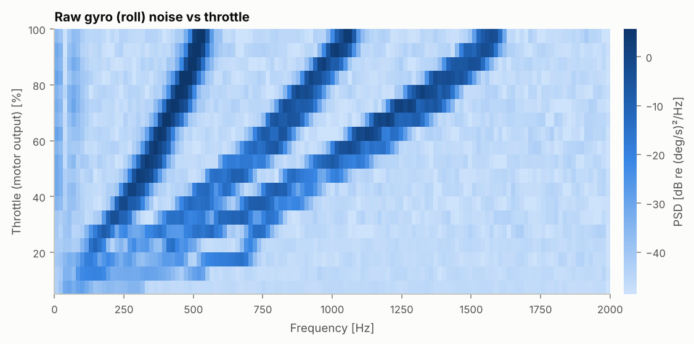
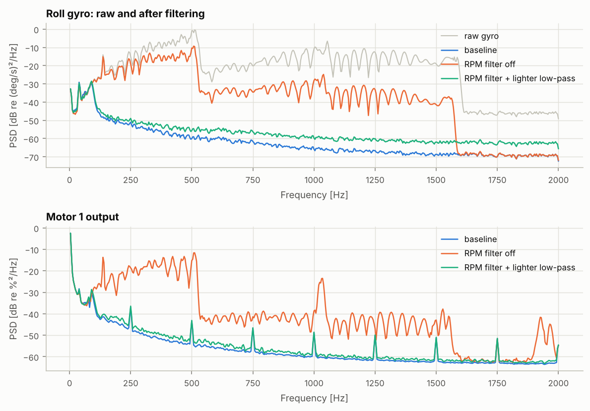
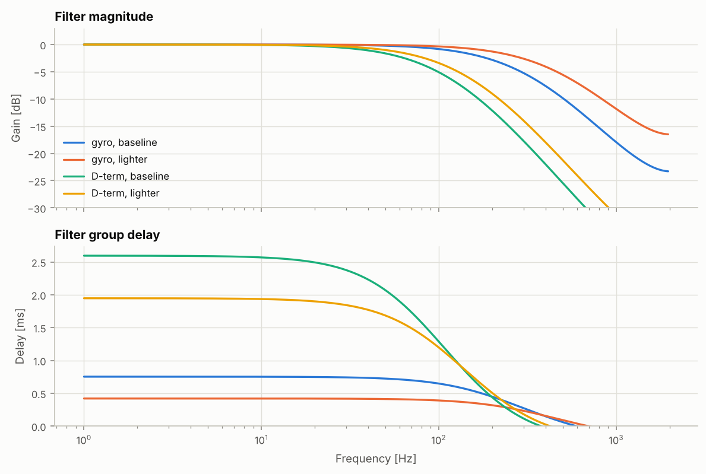
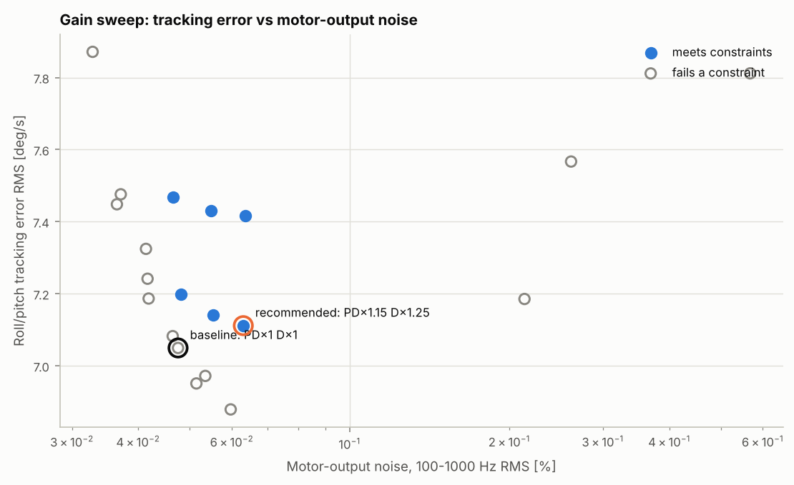
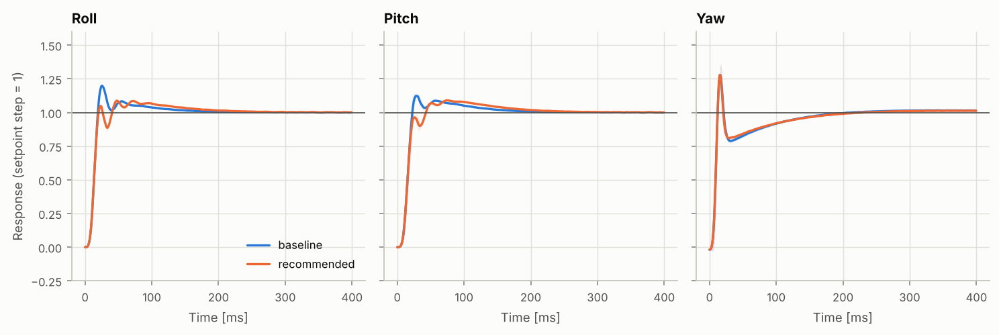

# 調參報告：參考機：5 吋 6S freestyle（通用零件）

> 由 `fpvsim tune` 自動產生。每次試飛使用相同的隨機種子與飛行腳本，所以候選設定之間的差異只來自設定本身。

| 項目 | 內容 |
|---|---|
| 機體 | `data/builds/ref-5in-6s-freestyle.toml` |
| 基準飛控設定 | 5 吋 Acro 基準設定（`acro-5in-baseline`） |
| 試飛次數 | 雜訊調查 3 次，增益掃描 20 次，feedforward 對照 1 次 |
| 程式版本 | fpvsim 0.1.0，git `4beb5ad55025` |
| 輸入檔雜湊 | `bf6fd48fa0720045` |
| 隨機種子 | 1 |
| 產生時間 (UTC) | 2026-10-08 14:26 |

## 摘要

- **RPM 濾波是最重要的濾波器：** 關閉它，雜訊調查（油門掃描飛行）中的馬達輸出雜訊從 0.081% 升到 2.877%（36 倍）；代價是 50 Hz 約 2.1 ms 的延遲（見第 1 節）。
- **建議增益：** PD×1.15 D×1.25。滾轉超調 20.5% → 8.7%，俯仰超調 14.3% → 9.2%，追蹤誤差 7.0 → 7.1 deg/s，調參飛行油門爬升段的馬達輸出雜訊 0.048% → 0.063%。設定檔：`recommended_fc.toml`。
- **滾轉比俯仰更容易超調**（基準設定 20.5% 對 14.3%）。F = 0 時是 15.2% 對 16.0%，所以差異來自 feedforward：滾轉的慣量較小（Ixx = 1.37、Iyy = 1.56 g·m²），同樣的 F 帶來較大的角加速度。下一輪應分軸調整 F。
- **偏航的超調主要來自 feedforward：**偏航 32.3%（F = 0 時 2.1%，上升時間 5.0 ms → 49.7 ms）。PD 掃描改變不了這部分，而且偏航不在判定規則內；下一輪應單獨掃描偏航的 F，在超調與上升時間之間取捨。
- **掃描範圍自動擴大了 1 輪**（D 1.5）：原本的建議值落在掃描範圍邊緣。
- **建議值的限制**（往各方向再走一格的候選）：PD 再加（PD×1.3 D×1.25）馬達雜訊是基準的 4.49 倍（上限 1.5 倍）；PD 再減（PD×1 D×1.25）追蹤誤差沒有更好；D 再加（PD×1.15 D×1.5）馬達雜訊是基準的 5.50 倍（上限 1.5 倍）；D 再減（PD×1.15 D×1）超調 18.0% 超過 15%。
- 雜訊最高的候選（PD×1.3 D×1.5）馬達雜訊 0.568%，是基準的 12.0 倍。
- **可信度：** 振動模型的振幅是估計值，所以雜訊的**絕對數值**尚未確認；但同一個模型下，不同設定之間的**相對比較**是有意義的。用實機的未濾波陀螺儀 log 辨識振動參數後，絕對數值才能採信。

## 1. 雜訊調查

油門掃描飛行（從低油門爬到全油門再收回，保持水平），以 PID 迴圈頻率 4000 Hz 記錄。下圖是未濾波陀螺儀的頻譜對油門：隨油門移動的斜線是馬達轉速的諧波（1 倍、2 倍與葉片通過頻率）。

| 濾波設定 | 原始陀螺儀 (deg/s) | 濾波後陀螺儀 (deg/s) | D 項 (PID 單位) | 馬達輸出 (%) | RPM 濾波延遲 | 陀螺儀濾波總延遲 | D 項總延遲 |
|---|---|---|---|---|---|---|---|
| 基準設定 | 11.85 | 0.061 | 0.31 | 0.081 | 2.1 ms | 2.8 ms | 4.9 ms |
| 關閉 RPM 濾波 | 11.81 | 4.396 | 14.24 | 2.877 | 0.0 ms | 0.7 ms | 2.8 ms |
| RPM 濾波 + 較輕的低通 | 11.85 | 0.079 | 0.51 | 0.108 | 2.1 ms | 2.5 ms | 4.2 ms |

雜訊為 100–1000 Hz 的 RMS（滾轉軸；馬達為四顆平均）。延遲為 50 Hz 的群延遲；陀螺儀濾波總延遲包含 RPM 濾波與陀螺儀低通，D 項總延遲再加上 D 項低通。RPM 濾波每一軸有 12 個陷波器（4 顆馬達 × 3 個諧波），每個在低頻約增加 1/(2π·Q·f0) 的延遲；以這次飛行的轉速中位數計算，合計在 50 Hz 約 2.1 ms，比陀螺儀低通濾波器還大（0.7 ms）。轉速越低，陷波頻率越低，延遲越大。它換來的是第一列與第二列之間的雜訊差異。

## 2. 濾波器

RPM 濾波：每顆馬達 3 個諧波的陷波器，Q = 5，最低 100 Hz。以這次飛行的轉速中位數（8567 rpm）為例，陷波中心在 143 Hz、286 Hz、428 Hz。

## 3. 增益掃描

以基準設定為中心，P 與 D 一起乘上「PD 倍數」，D 再另外乘上「D 倍數」，I 與 F 不變；建議值落在範圍邊緣時，自動往那個方向多加一排候選再選一次（PD 倍數 0.7, 0.85, 1, 1.15, 1.3；D 倍數 0.8, 1, 1.25, 1.5；共 20 組）。每個候選飛同一段調參飛行：每一軸有固定時間、小幅度的正反向步階。步階的時刻已知，所以直接在每一次步階量測超調、上升時間與安定時間，取中位數（基準設定：滾轉 8 次、俯仰 8 次、偏航 8 次；+a → −a 的反向步階是兩倍幅度，不計入）。雜訊只在最後一段平飛油門爬升中量測，因為步階本身的訊號也落在同一個頻帶。

**判定規則：** 滾轉與俯仰的超調各自 ≤ 15%（本專案的設計目標，不是業界標準；兩軸分別檢查，避免平均值掩蓋較差的一軸），且馬達輸出雜訊（100–1000 Hz RMS）不超過基準設定的 1.5 倍；符合條件者中，取同一段調參飛行中滾轉與俯仰追蹤誤差 (RMS) 最小的。超調取每一軸小幅度步階的中位數（0 → ±a 與 ±a → 0，正負方向各半；不含 ±a → ∓a 的反向步階，也不含混控飽和的步階）。

| 候選 | 滾轉超調 | 俯仰超調 | 滾轉上升時間 | 追蹤誤差 (deg/s) | 馬達雜訊 (%) | 混控飽和 | 條件 |
|---|---|---|---|---|---|---|---|
| PD×0.7 D×0.8 | 41.7% | 35.5% | 9.5 ms | 7.9 | 0.033 | 0.0% | 不符合 |
| PD×0.7 D×1 | 29.3% | 23.6% | 10.0 ms | 7.4 | 0.036 | 0.0% | 不符合 |
| PD×0.7 D×1.25 | 16.5% | 11.9% | 10.0 ms | 7.3 | 0.041 | 0.0% | 不符合 |
| PD×0.7 D×1.5 | 10.4% | 12.5% | 10.8 ms | 7.5 | 0.047 | 0.0% | 符合 |
| PD×0.85 D×0.8 | 36.3% | 30.0% | 9.7 ms | 7.5 | 0.037 | 0.0% | 不符合 |
| PD×0.85 D×1 | 23.9% | 18.1% | 10.0 ms | 7.2 | 0.042 | 0.0% | 不符合 |
| PD×0.85 D×1.25 | 11.8% | 10.1% | 10.5 ms | 7.2 | 0.048 | 0.0% | 符合 |
| PD×0.85 D×1.5 | 10.1% | 11.4% | 10.8 ms | 7.4 | 0.055 | 0.0% | 符合 |
| PD×1 D×0.8 | 32.7% | 26.5% | 9.7 ms | 7.2 | 0.042 | 0.0% | 不符合 |
| PD×1 D×1（基準） | 20.5% | 14.3% | 9.7 ms | 7.0 | 0.048 | 0.0% | 不符合 |
| PD×1 D×1.25 | 9.0% | 9.4% | 10.0 ms | 7.1 | 0.055 | 0.0% | 符合 |
| PD×1 D×1.5 | 9.7% | 10.6% | 11.0 ms | 7.4 | 0.064 | 0.0% | 符合 |
| PD×1.15 D×0.8 | 29.7% | 23.3% | 9.5 ms | 7.1 | 0.046 | 0.0% | 不符合 |
| PD×1.15 D×1 | 18.0% | 11.6% | 9.7 ms | 7.0 | 0.053 | 0.0% | 不符合 |
| PD×1.15 D×1.25（★ 建議） | 8.7% | 9.2% | 10.0 ms | 7.1 | 0.063 | 0.0% | 符合 |
| PD×1.15 D×1.5 | 9.9% | 10.6% | 11.0 ms | 7.6 | 0.261 | 0.0% | 不符合 |
| PD×1.3 D×0.8 | 27.8% | 21.3% | 9.5 ms | 7.0 | 0.051 | 0.0% | 不符合 |
| PD×1.3 D×1 | 15.8% | 9.4% | 9.5 ms | 6.9 | 0.060 | 0.0% | 不符合 |
| PD×1.3 D×1.25 | 9.7% | 9.4% | 10.0 ms | 7.2 | 0.213 | 0.0% | 不符合 |
| PD×1.3 D×1.5 | 11.6% | 11.3% | 11.2 ms | 7.8 | 0.568 | 0.0% | 不符合 |

基準與建議設定的步階響應（陰影為各次步階之間的 ±1 標準差）：

| 軸 | 基準超調 | 建議超調 | 基準上升時間 | 建議上升時間 | 基準延遲 | 建議延遲 |
|---|---|---|---|---|---|---|
| 滾轉 | 20.5% | 8.7% | 9.7 ms | 10.0 ms | 9.0 ms | 9.0 ms |
| 俯仰 | 14.3% | 9.2% | 10.5 ms | 11.0 ms | 9.5 ms | 10.0 ms |
| 偏航 | 32.3% | 32.6% | 5.0 ms | 5.0 ms | 2.0 ms | 2.0 ms |

**Feedforward 的貢獻：** 基準增益下把三軸的 F 設為 0，再飛同一段調參飛行。兩者的差異是 feedforward 造成的部分，PD 掃描改變不了它。

| 軸 | 超調（F 照設定） | 超調（F = 0） | 上升時間（F 照設定） | 上升時間（F = 0） |
|---|---|---|---|---|
| 滾轉 | 20.5% | 15.2% | 9.7 ms | 17.0 ms |
| 俯仰 | 14.3% | 16.0% | 10.5 ms | 17.5 ms |
| 偏航 | 32.3% | 2.1% | 5.0 ms | 49.7 ms |

## 4. 建議設定

| 軸 | 基準 P / I / D / F | 建議 P / I / D / F |
|---|---|---|
| 滾轉 | 40 / 70 / 30 / 100 | 46 / 70 / 43 / 100 |
| 俯仰 | 42 / 75 / 33 / 100 | 48 / 75 / 47 / 100 |
| 偏航 | 40 / 70 / 0 / 100 | 46 / 70 / 0 / 100 |

完整設定已寫入 `recommended_fc.toml`，可以直接用 `fpvsim fly --fc` 試飛。

下一步：
1. 用實機錄一段未濾波陀螺儀的 Blackbox log，辨識振動參數，讓雜訊的絕對數值可以採信。
2. 在建議設定下，評估「RPM 濾波 + 較輕的低通」能否在雜訊可接受時換到更低的延遲。

## 5. 方法與限制

- 步階響應：模擬的調參飛行知道每次步階的時刻，所以直接量測每一次步階（相對於步階大小正規化）。實機 log 沒有這個資訊時，改用 Wiener 反卷積（`flightanalysis.step_response`，2 秒視窗、只用該軸被打桿的時段），兩種方法都用已知系統驗證過（tests/test_flight.py）；全幅度打桿會讓混控飽和，量到的是非線性響應，所以調參用小幅度步階。
- 飛控依 Betaflight 的結構獨立實作（Actual rates、PID 數值尺度、D 項作用在量測值、RPM 濾波、airmode）；feedforward 的尺度、動態濾波、TPA、anti-gravity、I-term relax 等與 Betaflight 不同或沒有實作，所以調參結果是起點，不保證能一對一套用到實機。
- 振動只進入陀螺儀量測；機架共振與彈性沒有模擬。
- 試飛由自動測試飛手執行，它是測試工具，不代表人類飛手。
